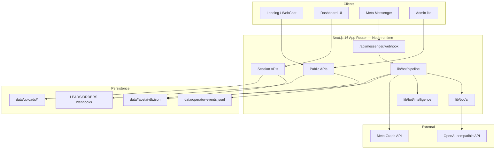
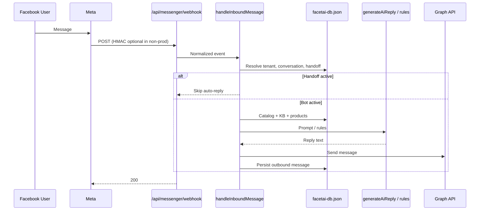
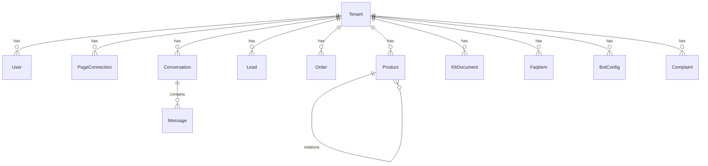

# FaceTai — Architecture (AI Knowledge Base)

| Field | Value |
| --- | --- |
| **Source** | Codebase audit 2026-07-26 + `docs/PRD.md` §10–11 |
| **Related** | [prd.md](./prd.md) · [design.md](./design.md) · [phases.md](./phases.md) · [rules.md](./rules.md) · [memory.md](./memory.md) |

This document describes the **real** architecture as implemented. Recommendations are marked **(Recommendation)**.

---

## High-level architecture



**Pattern:** Monolithic Next.js app — marketing site, ops dashboard, and bot webhook in one deployable unit. No separate worker process today.

---

## Tech stack

| Layer | Choice | Notes |
| --- | --- | --- |
| Framework | **Next.js 16.2.10** App Router | `runtime = "nodejs"` on API routes |
| UI | **React 19.2.4** | Client pages for dashboard interactivity |
| Language | **TypeScript 5** (`strict: true`) | Path alias `@/*` → `./src/*` |
| Styling | **Tailwind CSS v4** + custom CSS in `globals.css` | Design tokens as CSS variables |
| Data | **JSON file store** | `data/facetai-db.json` via `withDb()` |
| AI | Raw `fetch` to OpenAI-compatible chat | No OpenAI SDK dependency |
| Meta | Raw Graph API `fetch` | No Meta SDK |
| Auth | Custom session cookie | Base64url JSON payload — **not** NextAuth |
| Lint | ESLint 9 + `eslint-config-next` | |
| Seed | `tsx` + `scripts/seed.ts` | `npm run seed` |

**Not in dependencies:** Prisma/ORM, Redis, state libraries, Meta/OpenAI SDKs, auth libraries, test runners.

---

## Folder structure

```
FaceTai/
├── .cursor/                 # AI knowledge base (this folder)
├── data/
│   ├── facetai-db.json      # Multi-tenant store (gitignored content may vary)
│   ├── uploads/             # KB file extracts (ephemeral on serverless)
│   └── operator-events.jsonl
├── docs/
│   ├── PRD.md               # Product source of truth
│   ├── PHASE2-AI-BOT.md     # Bot implementation sketch (partially stale)
│   ├── QA-REPORT.md
│   └── qa-artifacts/
├── public/
├── scripts/seed.ts
├── src/
│   ├── app/
│   │   ├── page.tsx         # Landing
│   │   ├── layout.tsx       # Fonts + metadata (lang=bn)
│   │   ├── globals.css      # Design system + dashboard styles
│   │   ├── admin/           # Legacy admin-lite
│   │   ├── dashboard/       # Ops UI (layout → DashboardShell)
│   │   └── api/             # Route handlers
│   ├── components/          # Landing + WebChat + DashboardShell
│   └── lib/
│       ├── config.ts        # WhatsApp / public URLs
│       ├── leads.ts         # Re-export → db/leads
│       ├── leads-compat.ts  # Compat shim
│       ├── bot/             # Pipeline, AI, Messenger, intelligence, handoff
│       └── db/              # Store, types, domain modules, seed, auth
├── .env.example
├── package.json
└── README.md
```

### Feature boundaries

| Boundary | Owns |
| --- | --- |
| `src/app/api/messenger` + `lib/bot/*` | Inbound messaging, replies, Graph send |
| `src/app/api/dashboard/*` + `src/app/dashboard/*` | Authenticated ops UI/API |
| `src/app/api/leads`, `orders`, `webchat`, `comments` | Public / channel entrypoints |
| `src/lib/db/*` | Persistence + domain mutations |
| `src/components/*` (non-dashboard) | Marketing presentation |

---

## Data flow

### Inbound Messenger



### Dashboard read/write

1. Client `fetch` with session cookie `facetai_session`.
2. Route calls `requireSession` / `getSessionFromRequest`.
3. Domain function uses `withDb(fn)` — read → mutate → atomic write (tmp + rename) with write queue.
4. JSON `{ ok: true, ... }` or `{ error: "..." }` response.

### Lead capture

Landing `LeadForm` → `POST /api/leads` → `validateLead` + `storeLead` → optional `LEADS_WEBHOOK_URL` → WhatsApp deep link in response.

---

## API architecture

All handlers: Node.js runtime. Success shape typically `{ ok: true, ... }`. Errors: `{ error: string }` + 4xx/5xx.

### Public / channel

| Path | Methods | Auth |
| --- | --- | --- |
| `/api/leads` | POST | Public |
| `/api/orders` | POST | Public |
| `/api/webchat` | GET, POST | Public |
| `/api/bot/reply` | POST | **None** (test endpoint) |
| `/api/comments` | GET, POST | Public |
| `/api/comments/stub` | GET, POST | Public (POST → 501) |
| `/api/messenger/webhook` | GET, POST | Verify token / HMAC |
| `/api/admin/config` | GET, PUT | `x-admin-password` or `?password=` |

### Auth

| Path | Methods | Auth |
| --- | --- | --- |
| `/api/auth/login` | POST | Public |
| `/api/auth/logout` | POST | Public |
| `/api/auth/me` | GET | Session cookie or `x-facetai-session` |

### Connect (F39 scaffold)

| Path | Methods | Auth |
| --- | --- | --- |
| `/api/connect` | GET, POST | Session |
| `/api/connect/callback` | GET | OAuth `state` |

### Dashboard (session required)

| Path | Methods | Notes |
| --- | --- | --- |
| `/api/dashboard/summary` | GET | Bootstrap metrics |
| `/api/dashboard/chats` | GET, POST | Inbox + demo ingest |
| `/api/dashboard/leads` | GET, PATCH | CRM |
| `/api/dashboard/orders` | GET, POST, PATCH | Tracking |
| `/api/dashboard/orders/[id]/invoice` | GET | HTML invoice |
| `/api/dashboard/complaints` | GET, POST, PATCH | |
| `/api/dashboard/products` | GET, POST, PATCH, DELETE | Catalog |
| `/api/dashboard/recommendations` | GET, PATCH | Relations |
| `/api/dashboard/ecommerce` | GET, PUT, POST | Connectors + import |
| `/api/dashboard/knowledge` | GET, PUT, POST | FAQ/KB/config |
| `/api/dashboard/comments` | GET, PUT, POST | Settings + simulate |
| `/api/dashboard/team` | GET, POST | POST requires admin/manager |
| `/api/dashboard/analytics` | GET | Thin counts |

**(Recommendation):** Extract shared `requireDashboardSession()` helper — today session checks are duplicated per route. Lock down `/api/bot/reply` in production.

---

## Database architecture

### Store implementation

| Concern | Implementation |
| --- | --- |
| File | `data/facetai-db.json` |
| Access | `withDb`, `readDb` in `lib/db/store.ts` |
| Concurrency | Serialized write chain |
| Atomicity | Write temp file + rename |
| Version | `FaceTaiDb.version` `1 \| 2` |
| IDs | `newId("prefix")` |
| Timestamps | ISO strings via `nowIso()` |

### Collections (`FaceTaiDb`)

| Collection | Purpose |
| --- | --- |
| `tenants` | Orgs (`id`, `name`, `slug`) |
| `users` | Team users + **plain-text** `password` + `role` |
| `pages` | Facebook Page connections (`mode`: env/oauth/demo) |
| `conversations` | Threads + `channel` + handoff/complaint flags |
| `messages` | inbound/outbound/system + optional recognition |
| `leads` | CRM + follow-up fields |
| `orders` | Orders + tracking/courier/invoice |
| `products` | Catalog + upsell/crossSell/bundle relations |
| `kbDocuments` | Uploaded/stub knowledge |
| `faqItems` | Q/A |
| `botConfigs` | Per-tenant prompts/greeting |
| `complaints` | Complaint queue |
| `ecommerceConnections` | Store platform credentials |
| `commentSettings` / `commentEvents` | Comment AI |

Default demo: `tenant_demo`, `user_demo_admin`, sample products via `ensureSeeded`.



**(Recommendation):** Migrate to Postgres for production; encrypt Page tokens; hash passwords; move uploads to object storage. See [phases.md](./phases.md).

---

## Authentication

| Mechanism | Details |
| --- | --- |
| Login | Email/password against DB users OR demo `admin` / `admin@demo.facetai.local` + `ADMIN_PASSWORD` |
| Session | HttpOnly cookie `facetai_session` (14 days) — base64url JSON `SessionPayload` |
| Alternate | Header `x-facetai-session` |
| Admin-lite | `x-admin-password` / `?password=` matching `ADMIN_PASSWORD` |
| Non-prod looseness | If `ADMIN_PASSWORD` unset and not production, admin may be open; webhook signature may skip without secret |
| Client gate | `DashboardShell` → `/api/auth/me` → redirect login |

## Authorization

| Role | Values |
| --- | --- |
| `TeamRole` | `admin` \| `manager` \| `moderator` \| `agent` |

**Enforced today:** `POST /api/dashboard/team` requires `admin` or `manager`.  
**Elsewhere:** Role is stored but largely stub (Wave C / F44 polish).

Webhook: GET verify token; POST HMAC-SHA256 `X-Hub-Signature-256`.

---

## Component hierarchy

```
RootLayout (fonts, lang=bn)
├── / → Landing sections + WebChatWidget
│     Hero, Problem, Features, Pricing, SocialProof, FinalCTA→LeadForm, SiteFooter, ChatRibbon
├── /admin → client config + test reply
└── /dashboard/layout → DashboardShell
      ├── /login
      ├── Overview, Inbox, Leads, Orders, Complaints, Catalog, Recommendations
      ├── Ecommerce, Knowledge, Comments, Connect, Team, Analytics, Roadmap
```

State: **no** global store. Per-page `useState` + `fetch`. Server state = JSON DB.

---

## Services (`lib/bot`)

| Module | Responsibility |
| --- | --- |
| `pipeline.ts` | `handleInboundMessage` — full inbound orchestration |
| `ai.ts` | `generateAiReply`, `rulesReply`, system prompt builder |
| `messenger.ts` | Signature verify, normalize, Graph send text/image |
| `intelligence.ts` | Complaint detect, recommendations, image→product heuristics |
| `handoff.ts` | Handoff flags + operator event log |
| `config.ts` | Env getters + **deprecated** `BusinessConfig` wrapper |
| `orders.ts` | Re-export of `lib/db/orders` |

## Utilities / shared modules (`lib/db`)

Domain modules: `auth`, `leads`, `orders`, `products`, `conversations`, `knowledge`, `analytics`, `complaints`, `ecommerce`, `comments`, `invoice`, `seed`, `store`, `types`. Barrel: `lib/db/index.ts`.

Public config: `lib/config.ts` (WhatsApp number, interest options).

---

## State management

| Layer | Approach |
| --- | --- |
| Server | File DB + request-scoped session |
| Client | Local React state only |
| Auth | Cookie session |
| Chat widget | Ephemeral in-component message list |

---

## Caching & performance

| Current | Notes |
| --- | --- |
| No Redis / CDN app cache | — |
| Full DB read on each `withDb` | Fine for demo; **(Recommendation)** will not scale |
| AI fallback to rules | Avoids hard fail without API key |
| Fonts via `next/font` | Syne, Sora, Noto Sans Bengali |
| Dev bind | `127.0.0.1` default to avoid hung binds |

**Latency targets (PRD):** P50 ≤ 5s / P95 ≤ 15s first bot reply.

**(Recommendations):** Index-like in-memory cache per process for read-heavy paths; durable queue for Sheet webhooks; consider always-on worker if serverless cold starts break Meta webhooks (Q3 open).

---

## Security

| Control | Status |
| --- | --- |
| Secrets in env only | **Yes** (`.env.example` documents names) |
| Webhook HMAC | **Yes** in prod when secret set |
| Session cookie HttpOnly | **Yes** |
| Password hashing | **No** — plain text in JSON **(critical debt)** |
| Page token encryption | **No** — local plaintext **(debt for F39)** |
| `/api/bot/reply` open | **Risk** — no auth |
| Tenant scoping | Schema ready; must be verified on every query path |
| CORS / rate limits | Not implemented |

---

## Deployment

| Item | Detail |
| --- | --- |
| Target | **Vercel** (README / PRD) |
| Scripts | `dev` / `start` on `127.0.0.1`; `*:lan` on `0.0.0.0` |
| Webhook URL | `https://<domain>/api/messenger/webhook` |
| Subscribe fields | `messages`, `messaging_postbacks` (+ optional `message_echoes`) |
| Ephemeral FS | Do **not** rely on `data/` for production durability |
| Dual-mode tokens | Env `META_PAGE_ACCESS_TOKEN` for demo; Connect vault later |

### Environment variables

See `.env.example`: `LEADS_WEBHOOK_URL`, `ORDERS_WEBHOOK_URL`, `NEXT_PUBLIC_WHATSAPP_NUMBER`, `NEXT_PUBLIC_MESSENGER_URL` (real only), `META_*`, `OPENAI_API_KEY` / `AI_*`, `ADMIN_PASSWORD`.

---

## Scalability

| Today | Limit |
| --- | --- |
| Single JSON file | Concurrent writes queued; whole-file rewrite |
| Single Node process assumptions | Multi-instance serverless = lost/conflicting writes |
| Multi-tenant schema | Ready for DB migration |
| Channel adapters | Messenger + web real; others stubs |

**(Recommendation path):** Postgres (preferred per Q4) + object storage for KB + encrypted secrets vault + optional Redis for hot handoff → then WhatsApp adapter reusing `pipeline` core.

---

## Known architectural inconsistencies

1. **Dual bot config models:** deprecated `BusinessConfig` (`lib/bot/config`) vs `BotConfig` (`lib/db`).
2. **Dual leads entrypoints:** `lib/leads.ts`, `lib/leads-compat.ts`, `lib/db/leads.ts`.
3. **Dual admin surfaces:** `/admin` vs `/dashboard/knowledge`.
4. **PHASE2 docs** still mention `orders.jsonl` / comments stub-only — code uses unified DB + `/api/comments`.
5. **PRD honesty note** says “Wave B Connect not started” while “Current status” lists Connect scaffold — treat scaffold as **Partial**, Done criteria unmet.
6. **`normalizePhone`** duplicated in leads and orders modules.
7. **AI context assembly** repeated across `pipeline`, `webchat`, `bot/reply`.

---

## Architecture improvements (recommendations only)

| Priority | Improvement |
| --- | --- |
| P0 | Postgres + hashed passwords before multi-tenant production |
| P0 | Auth-gate `/api/bot/reply` in production |
| P1 | Shared session middleware for dashboard APIs |
| P1 | Single AI reply service used by pipeline/webchat/test |
| P1 | Encrypt Page tokens; remove plain passwords |
| P2 | Channel adapter interface (Messenger / WA / Web) |
| P2 | Remove deprecated `BusinessConfig`; retire admin-lite or redirect |
| P2 | Automated tenant-isolation tests |
