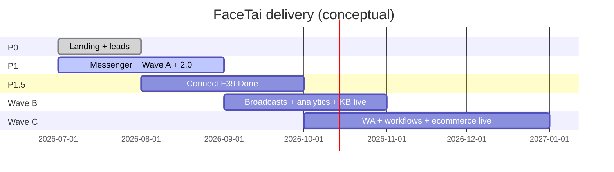

# FaceTai — Delivery Phases (AI Knowledge Base)

| Field | Value |
| --- | --- |
| **As of** | 2026-07-26 (code + docs audit) |
| **Naming** | PRD uses **P0 / P1 / P1.5 / P2** and **Waves A / B / C**. README historically said “Phase 1/2” for landing/bot — map: landing≈P0, Messenger≈P1 |
| **Related** | [prd.md](./prd.md) · [architecture.md](./architecture.md) · [memory.md](./memory.md) · `docs/audit/qa-report.md` |

Status keys: **Completed** · **In Progress** · **Partial** · **Planned** · **Blocked**

---

## Executive status

| Track | Status | Notes |
| --- | --- | --- |
| P0 Landing + leads | **Completed** (local) | Prod durable leads still need webhook/DB on host |
| P1 Messenger AI + Wave A surfaces | **Partial → mostly Complete (demo)** | E2E Meta production **Blocked** without credentials |
| FaceTai 2.0 Must surfaces | **Partial** | UI/API live; many connectors stubbed |
| P1.5 F39 Connect | **Partial** (scaffold) | Done criteria **not** met — do not market as live |
| Wave B | **Planned / Partial** | Analytics thin; KB hub stubs; broadcasts not built |
| Wave C | **Planned** | Workflows, voice, WL, live ecommerce, RBAC polish |
| QA (2026-07-20) | **52 Pass / 0 Fail / 4 Blocked** | Blocked: live Meta, webhook verify, OpenAI, public OAuth tunnel |

---

## Phase P0 — Landing & lead capture

| Field | Detail |
| --- | --- |
| **Objectives** | Sell FaceTai OS vision; capture leads; WhatsApp path |
| **Status** | **Completed** for local/demo |
| **Tasks done** | Landing sections; SaaS pricing ৳1,990+; lead form; `/api/leads`; fair-use disclaimer; webchat widget |
| **Remaining** | Production durable leads (`LEADS_WEBHOOK_URL` or DB); confirm sales one-pager always points to PRD |
| **Dependencies** | None |
| **Risks** | Ephemeral disk on Vercel loses local JSON |
| **Milestones** | See `docs/PRD.md` §15 P0 — durable production leads unchecked |
| **Next priorities** | Wire webhook/DB on first deploy |

---

## Phase P1 / Wave A — Messenger AI + tenant foundation + ops start

| Field | Detail |
| --- | --- |
| **Objectives** | Own bot; `tenantId` schema; dashboard; catalog (F40); CRM light (F43); KB PDF/Excel; sales recommend + follow-up |
| **Status** | **Completed** in code for demo; **In Progress** for production Meta E2E |
| **Tasks done** | Webhook route; pipeline; AI/rules; handoff; orders; catalog CRUD; CRM stages; dashboard shell; multi-tenant JSON; seed |
| **Partial** | Voice STT (Should); live comment Graph delete/reply; production signature + tokens |
| **Dependencies** | Meta App + Page tokens; optional `OPENAI_API_KEY` |
| **Risks** | App Review delays; serverless cold starts; hallucination without KB grounding |
| **QA** | Demo paths Pass; live Page round-trip **Blocked** |
| **Next priorities** | Production Meta E2E; Sheet webhooks; support SLA process doc |

---

## Phase FaceTai 2.0 Must surfaces (parallel to Wave A+)

| Surface | Status | Honest note |
| --- | --- | --- |
| Omnichannel Inbox UI | **Completed** | Channel filters; WA/IG/TG = stubs + demo ingest |
| Website chat | **Completed** | Real `channel=web` |
| Product recognition | **Completed** | Heuristic; vision optional with AI key |
| Orders + invoices | **Completed** | HTML invoice print path |
| Complaint Center | **Completed** | Keyword detect + queue + escalate |
| Recommendation engine | **Completed** | Relations + scoring UI |
| Ecommerce connectors | **Partial** | Save keys + stub sync; **CSV/JSON import works** |
| Knowledge Hub | **Partial** | PDF/Excel/CSV/TXT live; DOCX/Drive/Sheets/Notion stubs |
| Comment AI processing | **Completed** | Graph send needs tokens |
| Bangla-first prompts | **Completed** | |
| SaaS pricing on landing | **Completed** | |

---

## Phase P1.5 / Wave B start — FaceTai Connect (F39)

| Field | Detail |
| --- | --- |
| **Objectives** | Login FB → Select Page → Connect; auto webhook; no URL paste; ~2 min |
| **Status** | **Partial** — `/dashboard/connect` + `/api/connect` + callback + Demo Connect |
| **Not Done** | Encrypted token vault; full subscribe/permission UX; App Review–complete self-serve; marketing claim |
| **Dependencies** | `META_APP_ID`, `META_APP_SECRET`, `META_REDIRECT_URI`; public HTTPS; Meta product choices (Q12 open) |
| **Risks** | Meta API/product changes; overclaiming “2-minute Connect” |
| **Milestone** | PRD §15 P1.5 checklist — all unchecked for Done |
| **Next priorities** | Complete OAuth happy path on test Page; keep env-token dual-mode |

---

## Phase Wave B — Broadcasts, analytics depth, KB hub

| Item | Status |
| --- | --- |
| F41 Broadcasts | **Planned** (Roadmap page) |
| F47 Analytics depth | **Partial** — thin counts only |
| F48 Live KB sources | **Partial** — stubs for crawl/Drive/Sheets/Notion/FB FAQ |
| F39 Connect Done | **In Progress** / **Partial** |

| Field | Detail |
| --- | --- |
| **Dependencies** | Durable DB preferred before heavy analytics; Meta policy for broadcasts |
| **Risks** | Policy violations on broadcasts; OAuth complexity for KB sources |
| **Next priorities** | Deepen analytics metrics; live one KB source (e.g. Sheets) after Connect |

---

## Phase P2 / Wave C — Platform depth

| Item | Status |
| --- | --- |
| F22 WhatsApp Cloud live | **Planned** |
| F42 Courier API tracking | **Partial** — manual tracking fields live; APIs open (Q13) |
| F44 RBAC polish | **Partial** — roles stored; only team POST gated |
| F45 Voice Calling AI | **Planned** |
| F46 Live ecommerce sync | **Partial** → next |
| F49 Workflow builder | **Planned** |
| F50 White-label agency | **Planned** |
| Durable Postgres | **Planned** |
| F37 Billing portal | **Planned** (Could / post-P2) |
| F-mobile | **Planned** (Roadmap stub) |

| Field | Detail |
| --- | --- |
| **Dependencies** | Messenger stable; Postgres; Connect for SaaS narrative |
| **Risks** | Scope creep vs LazyChat parity; agency domain model undecided (Q14) |
| **Next priorities** | Postgres migration; WhatsApp adapter; live ecommerce sync for one platform |

---

## Phase map (Mermaid)

Dates are planning aids only — not contractual.

---

## Blocked items (external)

| Blocker | Needed |
| --- | --- |
| Live Messenger round-trip | `META_PAGE_ACCESS_TOKEN` + Page |
| Webhook verify success | `META_VERIFY_TOKEN` + public URL |
| LLM path QA | `OPENAI_API_KEY` or `AI_API_KEY` |
| Real Connect OAuth | App ID/secret + HTTPS tunnel (ngrok etc.) |

---

## Next priorities (ordered for agents)

1. **Do not** claim F39/F41/F45/F49/F50 live; label stubs honestly.
2. Production durability: Postgres or mandatory webhooks for leads/orders/conversations.
3. Complete F39 Connect Done criteria while keeping env dual-mode.
4. Auth harden: hash passwords; gate `/api/bot/reply` in production.
5. Deduplicate AI reply assembly + session checks ([architecture.md](./architecture.md)).
6. One live ecommerce sync (Woo or Shopify) beyond stub.
7. WhatsApp Cloud adapter after Messenger production stable.
8. Add automated tests (none in repo today) — tenant isolation + handoff + lead validation.

---

## Inconsistencies to resolve (docs)

| Issue | Resolution rule |
| --- | --- |
| PRD “Wave B Connect not started” vs Connect scaffold | Scaffold = Partial; Done = unchecked |
| PHASE2 “comments stub only” vs `/api/comments` | Code wins; update PHASE2 when touched |
| Persona “from ৳990” vs SaaS from ৳1,990 | Primary packaging = SaaS table; ৳990 = legacy service |
| Milestone checkboxes lag Current status | Prefer Current status + QA for “what works”; milestones for “Done” |

---

## Completion snapshot for AI

When asked “what’s shipped?”, answer with:

- **Shipped (demo):** Landing, leads, webchat, dashboard ops, catalog, CRM, orders/invoices, complaints, recommendations, comment processing, Bangla rules/AI, ecommerce import, Connect/Demo Connect scaffold, multi-tenant JSON.
- **Stub:** Live WA/IG/TG Graph, live ecommerce REST, DOCX/Drive/Sheets/Notion OAuth, full Connect Done, deep analytics, RBAC everywhere.
- **Not built:** Broadcasts, voice calling, workflow builder, white-label, native mobile, billing portal.
