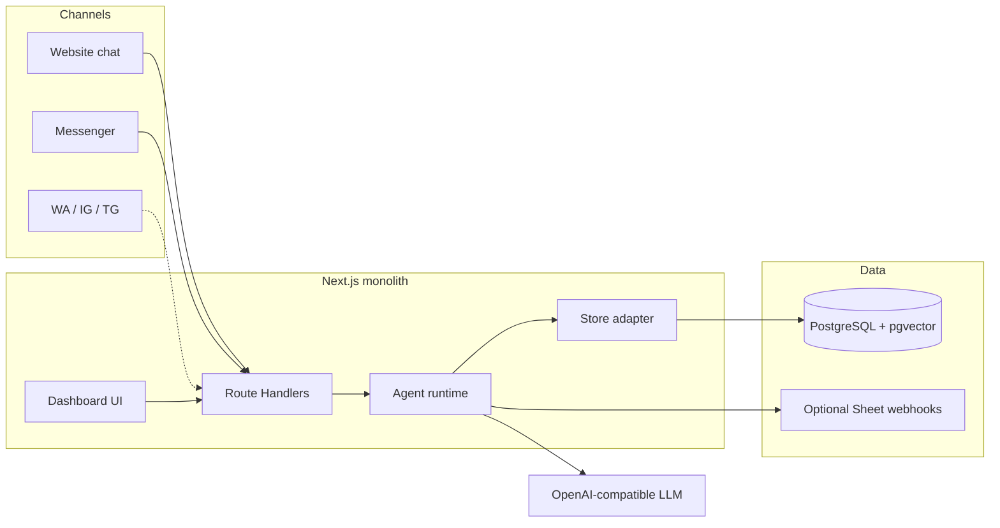
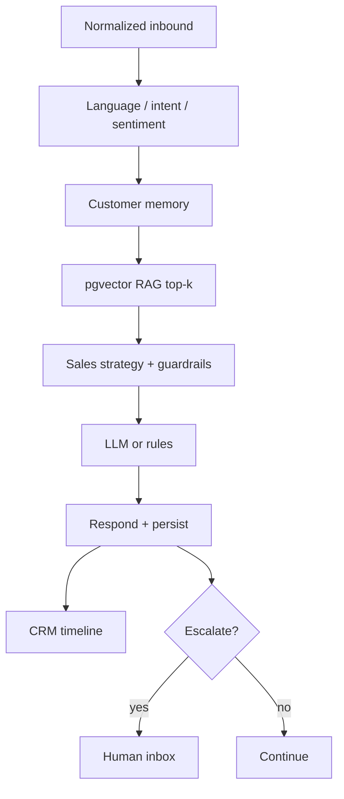

# FaceTai — Architecture

> **Status:** Target architecture (Phase 0) — 2026-07-26  
> **Locks:** [`BUSINESS_DECISIONS.md`](./BUSINESS_DECISIONS.md) DOC-2…DOC-5  
> **Related:** [`PRD.md`](./PRD.md) · [`PHASES.md`](./PHASES.md) · [`API.md`](./API.md)

---

## Principles

1. **One Next.js monolith** — App Router UI + Route Handlers; no Nest/FastAPI split.
2. **Postgres is source of truth** — replace JSON file behind a stable store adapter.
3. **Thin channel adapters** — Messenger / web / later WA-IG-TG only differ at send/receive.
4. **Shared agent runtime** — Sales first; other agents swap prompt/tools later.
5. **Redis later** — only on PHASES capacity trigger (not Phase 1).

---

## System context



---

## Stack

| Layer | Choice | Notes |
| --- | --- | --- |
| Framework | Next.js App Router + TypeScript + Tailwind | Evolve existing `FaceTai` app |
| Auth | Signed session cookie; hashed passwords (Phase 1) | Replace base64/plaintext demo |
| DB | PostgreSQL | `DATABASE_URL`; Docker Compose locally |
| ORM | Prisma (default) or Drizzle | Behind `src/lib/db` |
| Vectors | pgvector | Embeddings for RAG |
| AI | Existing AI client + rules fallback | No vendor lock in adapter |
| Hosting | Vercel / Render / Node host | Bind `0.0.0.0:$PORT` where required; ephemeral FS ≠ store |
| Queue | None in Phase 1 | Redis/BullMQ Phase 2+ if needed |

---

## Store adapter

**Today:** `src/lib/db/store.ts` → `data/facetai-db.json`.

**Target:** Keep call sites in `src/lib/db/*` stable; swap implementation to Prisma/Postgres.

```
src/lib/db/
  types.ts          # domain types
  store.ts          # adapter interface / implementation
  repositories/     # optional split by entity
```

**Migrate:** one-shot script `facetai-db.json` → Postgres. Dual-read cutover acceptable briefly; JSON not production SoT after Phase 1 Done.

**Tenancy:** every business row carries `tenantId`; queries default-deny cross-tenant.

---

## Channel adapters

| Channel | Inbound | Outbound | Phase |
| --- | --- | --- | --- |
| Website | `POST /api/webchat` | Same response / poll as designed | Current → harden Phase 1 |
| Messenger | `GET/POST /api/messenger/webhook` | Meta Graph Send | Current |
| WhatsApp / IG / Telegram | Webhooks (future) | Provider send APIs | Phase 3 |
| Connect | OAuth + subscribe Page | — | Phase 3 Done |

Adapters normalize to a common envelope: `{ tenantId, channel, threadId, userId, text, attachments, metadata }` → agent runtime.

---

## Agent runtime



| Module | Responsibility |
| --- | --- |
| Detect | BN/EN/Banglish; intent; sentiment; complaint keywords |
| Memory | Prior orders, prefs, open leads (Phase 2 deepens fields) |
| RAG | Retrieve chunks; never dump entire KB |
| Strategy | Sales playbook + [`AI_GUARDRAILS.md`](./AI_GUARDRAILS.md) |
| Tools | Catalog lookup, order create/status — DB-backed only |
| Handoff | Confidence &lt; 70%, refund/legal/angry, explicit human ask |
| CRM | Append timeline events |

**Agent packs (later):** same runtime; different system prompt + tool allowlist (Support, Booking, Property).

---

## RAG (Phase 1)

1. Upload → extract text  
2. Chunk (stable size/overlap)  
3. Embed → store in pgvector  
4. On reply: query top-k by tenant + similarity  
5. Inject chunks into prompt; cite/refuse when empty  

Replace today’s FAQ/upload prompt stuffing.

---

## When to add Redis

| Situation | Decision |
| --- | --- |
| Phase 1 MVP | **No Redis** |
| Scheduled follow-ups / campaigns overwhelm request path | Add Redis + worker |
| Webhook processing must ACK fast under spike | Queue after verify/signature |
| Simple cron on one always-on instance enough | Prefer that first |

Document the trigger in deploy notes when introduced ([`PHASES.md`](./PHASES.md)).

---

## Environments

| Env | Store | Notes |
| --- | --- | --- |
| Local | Docker Postgres | `npm run seed` against DB |
| Preview / prod | Managed Postgres | Neon / Supabase / Render Postgres |
| Optional | `LEADS_WEBHOOK_URL` / `ORDERS_WEBHOOK_URL` | Sheet familiarity for BD ops |

**Never:** rely only on container/local disk for conversations, CRM, or KB in production.

---

## Security boundaries (summary)

See [`SECURITY.md`](./SECURITY.md): session auth, RBAC, tenant filters, secrets in env, encrypted Page tokens (Connect), PII minimization.

---

## Version history

| Date | Notes |
| --- | --- |
| 2026-07-26 | Phase 0 architecture: monolith + Postgres + pgvector + adapters + runtime |
