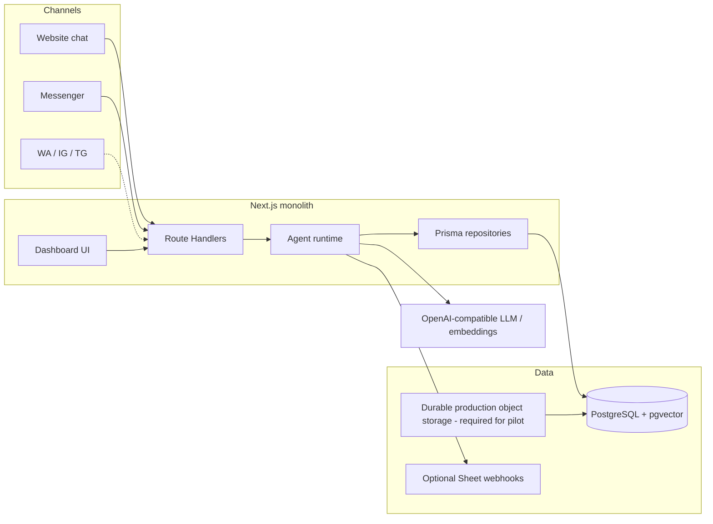
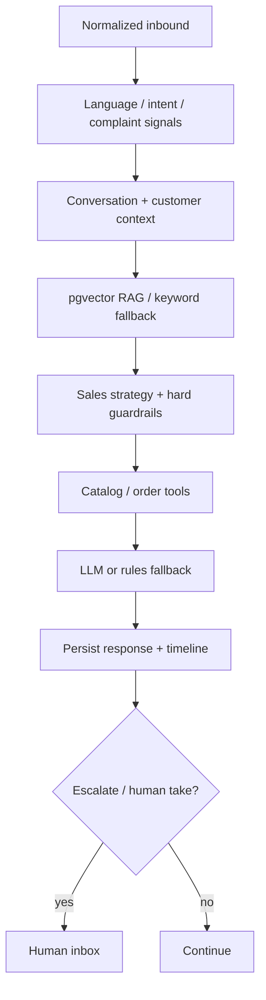

# FaceTai — Architecture

> **Status:** Implemented baseline + production-hardening target — 2026-08-21  
> **Canonical execution:** [`REAL-APPROACH.md`](./REAL-APPROACH.md)  
> **Locks:** [`BUSINESS_DECISIONS.md`](./BUSINESS_DECISIONS.md) DOC-2…DOC-5  
> **Related:** [`PRD.md`](./PRD.md) · [`PHASES.md`](./PHASES.md) · [`API.md`](./API.md)

---

## Principles

1. **One Next.js monolith** — App Router UI + Route Handlers; no Nest/FastAPI split.
2. **Postgres is the production source of truth** — the Prisma/Postgres implementation is already in the repository; JSON is migration/legacy input only.
3. **Thin channel adapters** — Messenger and web normalize into shared conversation/runtime behavior; WA/IG/TG remain future adapters.
4. **Shared agent runtime** — Sales first; other agents reuse the same core later.
5. **Redis later** — only on the measured PHASES capacity trigger.
6. **Code + tests define implementation status** — a model or UI alone does not make a feature production-ready.

---

## System context



---

## Stack

| Layer | Choice | Current reality |
| --- | --- | --- |
| Framework | Next.js App Router + TypeScript + Tailwind | Implemented |
| Auth | bcrypt + signed JWT HTTP-only cookie | Implemented; security verification still required |
| DB | PostgreSQL | Implemented through Prisma |
| ORM | Prisma | Implemented under `src/lib/db/*` |
| Vectors | pgvector | Implemented with keyword fallback |
| AI | OpenAI-compatible endpoint + rules fallback | Implemented |
| Hosting | Durable Node/managed Postgres host | Deployable; production storage/observability still need pilot gate |
| Queue | None | Correct for current milestone |
| File storage | Local `data/uploads` today | **Not production durable; must be replaced before pilot** |

---

## Persistence architecture

The old JSON store is no longer the production architecture.

Current repository structure uses Prisma-backed domain modules such as:

```text
src/lib/db/
  auth.ts
  conversations.ts
  leads.ts
  orders.ts
  knowledge.ts
  rag.ts
  analytics.ts
  audit.ts
  comments.ts
  complaints.ts
  ecommerce.ts
  invoice.ts
  ...
```

The JSON migration script remains for legacy/demo migration. It must not become a second production source of truth.

**Tenancy:** every business row carries `tenantId`; every authenticated dashboard mutation must derive tenant scope from the trusted session and reject mismatches.

---

## Channel adapters

| Channel | Inbound | Outbound | Current status |
| --- | --- | --- | --- |
| Website | `POST /api/webchat` | Response | Implemented; harden public tenant/embed model |
| Messenger | `GET/POST /api/messenger/webhook` | Meta Graph Send | Implemented; production signature/configuration test required |
| WhatsApp / IG / Telegram | Future webhooks | Provider APIs | Planned |
| Connect | Demo/OAuth scaffold | — | Scaffold; not a production SaaS promise |

Adapters should normalize to a common envelope such as `{ tenantId, channel, threadId, userId, text, attachments, metadata }` before agent-specific processing.

---

## Agent runtime



### Grounding order

1. Hard guardrails
2. Tenant Prompt Builder personality
3. Retrieved tenant-scoped knowledge
4. Catalog/order tool results
5. Conversation context
6. LLM generation

If factual evidence is missing, the agent must refuse or escalate rather than invent.

---

## RAG implementation

The repository now has a real first implementation:

1. Upload/extract text
2. Chunk into overlapping segments
3. Call configured embeddings endpoint when available
4. Store vectors in `KbChunk.embedding`
5. Query pgvector top-k by tenant
6. Fall back to keyword scoring if embeddings are unavailable/fail
7. Inject a bounded retrieved context into the reply pipeline

This is **implemented**, but RAG quality is not considered production-proven until Wave A/C evaluation measures retrieval accuracy and grounding behavior.

### Known limitation

KB files are currently written under the application filesystem. That is acceptable for local development but **not** a durable production storage strategy on ephemeral hosts. Pilot deployment must use durable object storage or an equivalent persistent volume.

---

## Security boundaries

- Session identity comes from a signed HTTP-only cookie.
- Passwords are bcrypt hashes.
- Dashboard role helpers provide `admin > manager > moderator > agent` gates.
- Repository queries are tenant-scoped.
- Audit logs exist for privileged changes.
- Messenger supports Meta signature verification when configured.
- Public endpoints use rate limiting.

These controls are implemented in meaningful portions of the codebase but still require systematic endpoint-by-endpoint verification before production claims.

See [`SECURITY.md`](./SECURITY.md).

---

## When to add Redis

| Situation | Decision |
| --- | --- |
| Current Sales Agent milestone | **No Redis** |
| Scheduled follow-ups/campaigns exceed safe request path | Add Redis + worker |
| Webhook processing cannot ACK reliably under measured load | Queue after verification |
| Simple cron on one always-on instance is enough | Prefer cron first |

---

## Environments

| Env | Store | Notes |
| --- | --- | --- |
| Local | Docker Postgres + pgvector | Seed against empty DB |
| Preview / prod | Managed Postgres | `DATABASE_URL` |
| Files | Durable object storage required for pilot | Do not rely on ephemeral disk |
| Optional | `LEADS_WEBHOOK_URL` / `ORDERS_WEBHOOK_URL` | Google Sheet bridge for BD ops |

**Never:** rely only on container/local disk for conversations, CRM, or production KB assets.

---

## Current architecture decision

The correct next step is **not** a rewrite. Keep the current monolith and make it trustworthy:

```text
Verify → Harden → Complete Sales MVP → Pilot → Measure → Expand
```

Do not add microservices, Redis, or new channel infrastructure until the measured workload/product evidence justifies it.

---

## Version history

| Date | Notes |
| --- | --- |
| 2026-07-26 | Phase 0 architecture: monolith + Postgres + pgvector + adapters + runtime |
| 2026-08-21 | Reclassified as implemented baseline; documented actual Prisma/RAG/auth layers and remaining production hardening |
