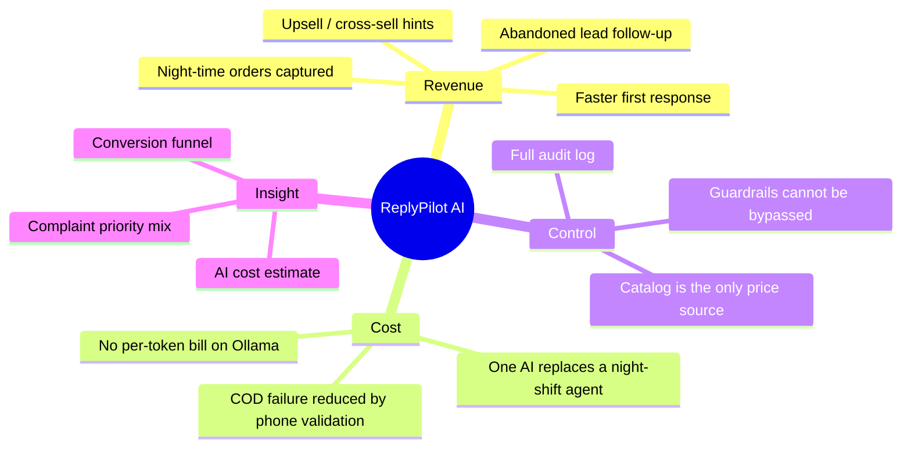
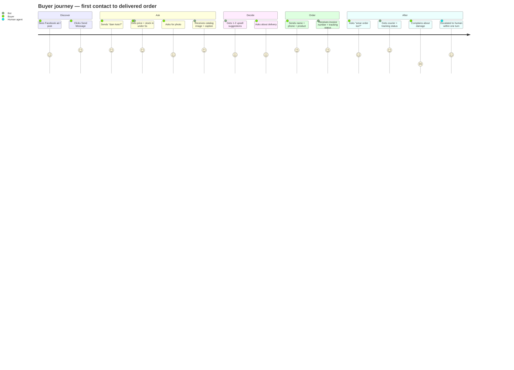
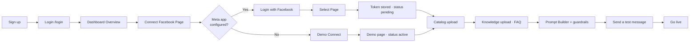

# 01 · Product overview

> 🏢 BIZ · 📦 PM · 🎨 DES · ✍️ TW

---

## 1.1 Overview

**ReplyPilot AI** is an *AI Employee platform*. The first employee it ships is a
**Sales Agent** that lives inside a Bangladeshi small business's Facebook Page
inbox and website chat, answers in Bangla, sells from a real catalog, captures
orders, and hands off to a human the moment it should not be talking.

```
┌───────────────────────────────────────────────────────────────────────┐
│                                                                       │
│   Customer                ReplyPilot AI                Business owner │
│   ─────────                ─────────────                ───────────── │
│                                                                       │
│   "কুর্তি দাম কত?"   →   catalog + RAG + LLM     →    Dashboard        │
│                            ↓                          • Inbox         │
│   "অর্ডার করতে চাই"  →   order parsed + invoice  →    • Orders        │
│                            ↓                          • Leads / CRM   │
│   "টাকা ফেরত দেন"   →   ESCALATE → human        →    • Complaints    │
│                                                                       │
└───────────────────────────────────────────────────────────────────────┘
```

| Attribute | Value |
| --- | --- |
| Product name | ReplyPilot AI |
| Repository codename | `FaceTai` |
| Version | `0.1.0` |
| Primary market | Bangladesh SMB / F-commerce |
| Primary language | Bangla (Banglish + BD slang tolerant), English fallback |
| Deployment shape | Single Next.js App Router monolith |
| Tenancy | Multi-tenant, `tenantId` on every business row |
| Currency | BDT (৳) |

---

## 1.2 Purpose

### The problem, stated precisely

A Bangladeshi F-commerce Page receives 50–500 DMs a day. Roughly 80% are the
same six questions: *price, stock, size, colour, delivery time, order status*.
The owner answers them personally, on a phone, between 9am and 1am.

| Failure mode | Business cost |
| --- | --- |
| Reply after 30 min | Buyer already ordered from a competitor |
| Owner asleep | Entire night's demand lost |
| Manual order transcription | Wrong phone, wrong size, failed COD delivery |
| No follow-up on "ভাবছি" | Lead evaporates silently |
| Angry customer meets a bot | Public comment damage |

### What ReplyPilot AI does about it

| Capability | Mechanism | Status |
| --- | --- | --- |
| Instant Bangla replies 24/7 | LLM with rule-based fallback | 🟢 SHIPPED |
| Never invents price/stock | Catalog injected into system prompt + hard guardrail | 🟢 SHIPPED |
| Order capture from free text | `tryParseOrderFromText` + invoice number | 🟢 SHIPPED |
| Order tracking answers | Phone / sender lookup against `Order` | 🟢 SHIPPED |
| Business-specific knowledge | pgvector RAG over uploaded documents + FAQ | 🟢 SHIPPED |
| Refuses to handle refunds/legal/anger | Escalation guardrails → human handoff | 🟢 SHIPPED |
| Human takeover detection | Messenger `is_echo` event → auto handoff | 🟢 SHIPPED |
| Complaint triage | Regex severity ladder → `Complaint` row + priority | 🟢 SHIPPED |
| Product recognition from photos | Heuristic catalog match, then vision LLM | 🟢 SHIPPED |
| Comment auto-reply + spam filter | Processed and stored, **not sent to Meta** | 🟡 PARTIAL |
| Facebook Page connect (OAuth) | Token exchanged, **webhook not subscribed** | 🟡 PARTIAL |
| WhatsApp Cloud API | — | 🔴 SPEC |

---

## 1.3 Business benefits

### For the business owner



### Quantified value model

| Lever | Baseline | With ReplyPilot AI | Basis |
| --- | --- | --- | --- |
| First-response time | 15–120 min | < 5 s | Webhook → send is synchronous |
| Hours covered | ~12 h/day | 24 h/day | Server-side, no human required |
| Order data accuracy | Manual retype | Parsed + confirmed + invoice | `storeOrder` assigns `invoiceNumber` |
| Escalation safety | Ad hoc | 5 deterministic escalation classes | `evaluateEscalation` |
| Marginal AI cost | — | ৳0 on local Ollama | `AI_PROVIDER=ollama` default in `.env.example` |

### Pricing posture (as encoded in `src/lib/config.ts` and rule replies)

| Plan | Price | Positioning |
| --- | --- | --- |
| Starter | ৳1,990/mo | Single Page, rules + light LLM |
| Growth | ৳4,990/mo | Full AI + RAG |
| Pro | ৳9,990/mo | Multi-page, team roles |
| Business | ৳14,990/mo | Higher AI budget, analytics |
| Enterprise | Custom | Dedicated model / VPC |

One-time setup add-ons: rule bot ৳3,900–6,900 · AI bot ৳8,000–20,000 · custom agent ৳15,000+.

---

## 1.4 Personas

| Persona | Role in product | Primary surface | RBAC role |
| --- | --- | --- | --- |
| **Rahim** — Page owner | Owns catalog, prices, prompt | Dashboard → Overview, Catalog, Knowledge | `admin` |
| **Nusrat** — Ops manager | Runs orders + complaints | Orders, Complaints, Analytics | `manager` |
| **Shakib** — Comment moderator | Cleans Page comments | Comments AI | `moderator` |
| **Tanya** — Chat agent | Takes over hard conversations | Inbox | `agent` |
| **Platform operator** | Runs the SaaS | `/admin/tenants` | `SUPER_ADMIN_EMAIL` |
| **Customer** | Buys things | Messenger / website widget | — |

Role ranking is enforced numerically in `src/lib/db/auth.ts`:

```
admin 40  >  manager 30  >  moderator 20  >  agent 10
```

---

## 1.5 User journey — buyer



### Journey with system events overlaid

| # | Buyer action | System event | Persisted |
| --- | --- | --- | --- |
| 1 | Opens Messenger thread | — | — |
| 2 | Sends first message | `POST /api/messenger/webhook` | `Conversation` upsert, `Message` (inbound) |
| 3 | — | `resolveTenantIdForPage` | — |
| 4 | — | dedupe on `mid` | — |
| 5 | — | RAG retrieve top-5 chunks | — |
| 6 | Receives reply | Graph `POST /me/messages` | `Message` (outbound) |
| 7 | Sends order details | `tryParseOrderFromText` | `Order` + `invoiceNumber` |
| 8 | Complains | `detectComplaint` | `Complaint` + `Conversation.handoffActive = true` |
| 9 | Human replies from Page inbox | `is_echo` webhook | `AuditLog` `echo_handoff` |

---

## 1.6 User journey — business owner (onboarding)



**Time-to-value target:** under 15 minutes from login to first AI reply.

> 🟡 **GAP-01** — step *I* stops at `status: "pending"`. Webhook subscription and
> permission verification are not performed. See
> [`05-messenger-connect.md`](./05-messenger-connect.md).

---

## 1.7 Dashboard information architecture

Fourteen sections, defined in `src/components/dashboard/DashboardShell.tsx`:

```
Dashboard
├─ Overview ............ KPI cards: chats, orders, revenue, conversion, leads, AI cost
├─ Inbox ............... omnichannel threads · take/leave handoff · notes · timeline
├─ Leads / CRM ......... crmStage pipeline, follow-up queue
├─ Orders .............. status + trackingStatus + courier + invoice
├─ Complaints .......... priority · status · resolution
├─ Catalog ............. products, price, stock, size, colour, images
├─ Recommendations ..... upsell / cross-sell / bundle relations
├─ Ecommerce ........... external store connections (Shopify-style)
├─ Knowledge ........... FAQ, document upload → chunk → embed, Prompt Builder
├─ Comments AI ......... auto-reply text, spam keywords, lead capture, event log
├─ Connect ............. Facebook Page OAuth / Demo connect
├─ Team ................ RBAC user management
├─ Analytics ........... funnel and cost analytics
└─ Roadmap ............. planned features (in-product changelog)

Platform
├─ /admin .............. legacy knowledge editor (admin-lite)
└─ /admin/tenants ...... super-admin: list / disable tenants
```

---

## 1.8 Competitive positioning

| Dimension | Generic chatbot builders | ReplyPilot AI |
| --- | --- | --- |
| Language | English-first, Bangla bolted on | Bangla-first, Banglish + typo tolerant by design |
| Pricing knowledge | Free-text FAQ | Structured catalog injected per request; guardrail forbids invention |
| Order handling | Form links | Free-text parse → `Order` row → invoice number |
| Escalation | Keyword → email | Five deterministic classes + auto handoff + audit |
| Complaint handling | None | Severity ladder → `Complaint` entity with resolution workflow |
| Cost floor | Per-message | ৳0 marginal on self-hosted Ollama |
| Tenancy | Workspace | Row-level `tenantId` with default-deny public resolution |

---

## 1.9 What this product deliberately does not do (yet)

| Not doing | Why | Tracked as |
| --- | --- | --- |
| Payment collection | COD dominates the market; PCI scope not worth it in v1 | Roadmap Q3 |
| Live comment delete/reply on Meta | Requires App Review for `pages_manage_engagement` | GAP-08 |
| WhatsApp | Requires Business Manager + embedded signup | GAP-12 / ch. 07 |
| Background job queue | Phase-1 lock: no Redis until capacity trigger | GAP-05 |
| Voice / IVR | Out of scope | — |

---

**Next:** [`02-architecture.md`](./02-architecture.md)
