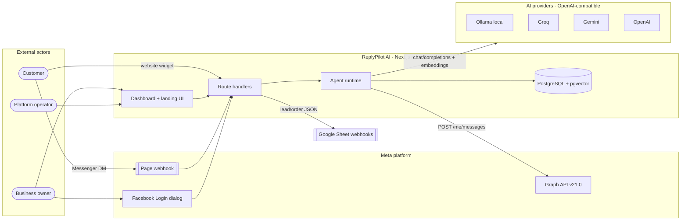
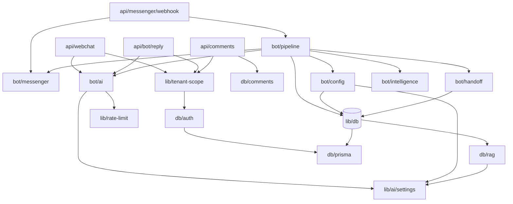
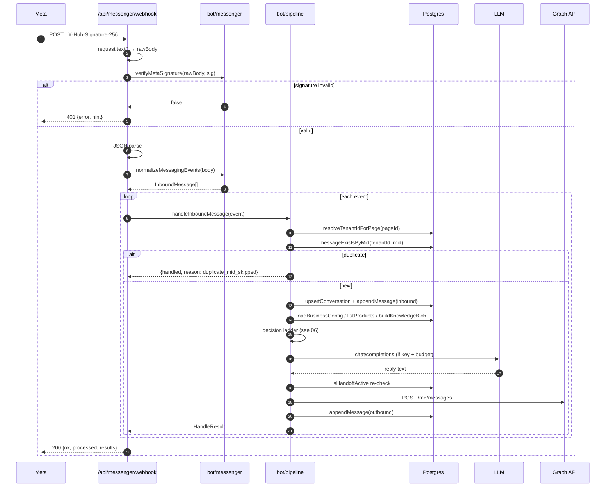
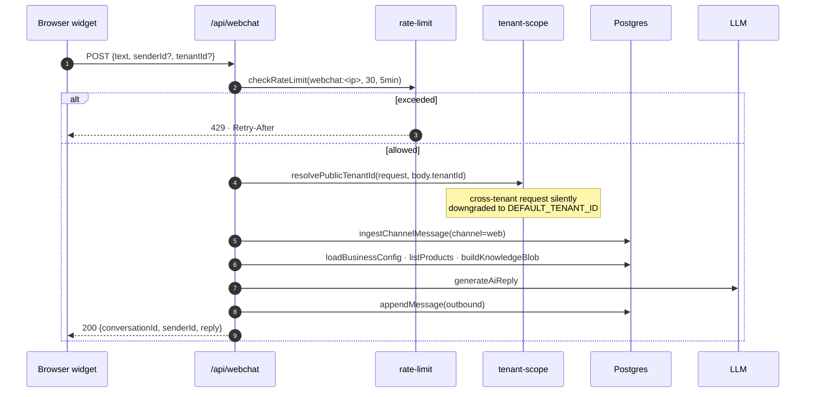
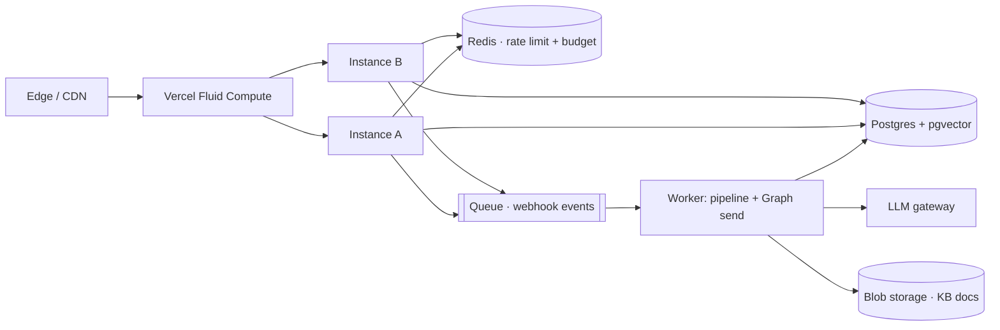

# 02 · Architecture

> 🧑‍💻 ENG · 🔐 SEC · 📦 PM

---

## 2.1 Architectural principles (locked)

| # | Principle | Consequence |
| --- | --- | --- |
| 1 | **One Next.js monolith** | No Nest/FastAPI split. All logic in Route Handlers + `src/lib`. |
| 2 | **Postgres is the single source of truth** | Filesystem is ephemeral; JSON store retired. |
| 3 | **Thin channel adapters** | Messenger / web differ only at send & receive. |
| 4 | **Shared agent runtime** | Sales agent first; future agents swap prompt + tools. |
| 5 | **No queue until a capacity trigger fires** | Redis/BullMQ is Phase 2+, not now. |
| 6 | **Fail closed** | Unsigned session → no session. Unknown tenant → default tenant. |

---

## 2.2 System context (C4 level 1)



---

## 2.3 High-level architecture (C4 level 2 — containers)

```
┌─────────────────────────────────────────────────────────────────────────────┐
│  Next.js 16 App Router · Node.js runtime · single process                   │
│                                                                             │
│  ┌───────────────┐  ┌────────────────────────┐  ┌────────────────────────┐  │
│  │ Presentation  │  │ Route handlers (API)   │  │ Cross-cutting          │  │
│  │               │  │                        │  │                        │  │
│  │ /             │  │ /api/messenger/webhook │  │ src/proxy.ts           │  │
│  │ /login        │  │ /api/webchat           │  │  └ path normalisation  │  │
│  │ /dashboard/*  │  │ /api/bot/reply         │  │ src/instrumentation.ts │  │
│  │ /admin/*      │  │ /api/comments          │  │  └ fail-fast env check │  │
│  │ /privacy      │  │ /api/leads             │  │ src/lib/rate-limit.ts  │  │
│  │ /terms        │  │ /api/orders            │  │ src/lib/tenant-scope.ts│  │
│  │ WebChatWidget │  │ /api/connect[/callback]│  │ src/lib/db/audit.ts    │  │
│  │               │  │ /api/auth/*            │  │                        │  │
│  │               │  │ /api/dashboard/*       │  │                        │  │
│  │               │  │ /api/admin/*           │  │                        │  │
│  │               │  │ /api/health            │  │                        │  │
│  └───────┬───────┘  └───────────┬────────────┘  └────────────────────────┘  │
│          │                      │                                           │
│          └──────────┬───────────┘                                           │
│                     ▼                                                       │
│  ┌──────────────────────────────────────────────────────────────────────┐   │
│  │ Agent runtime · src/lib/bot                                          │   │
│  │  pipeline.ts   orchestration + ordered decision ladder               │   │
│  │  handoff.ts    escalation rules, handoff state, operator audit       │   │
│  │  intelligence.ts complaint detection, recommendations, image match   │   │
│  │  ai.ts         system-message builder, LLM call, rules fallback      │   │
│  │  messenger.ts  signature verify, event normalise, Graph send         │   │
│  │  config.ts     tenant BotConfig + env accessors                      │   │
│  └──────────────────────────────┬───────────────────────────────────────┘   │
│                                 ▼                                           │
│  ┌──────────────────────────────────────────────────────────────────────┐   │
│  │ Data access · src/lib/db (Prisma)                                    │   │
│  │  prisma.ts conversations.ts orders.ts products.ts leads.ts           │   │
│  │  rag.ts knowledge.ts comments.ts complaints.ts ecommerce.ts          │   │
│  │  auth.ts audit.ts timeline.ts analytics.ts invoice.ts types.ts       │   │
│  └──────────────────────────────┬───────────────────────────────────────┘   │
└─────────────────────────────────┼───────────────────────────────────────────┘
                                  ▼
                   ┌──────────────────────────────┐
                   │ PostgreSQL 16 + pgvector     │
                   │ 18 tables · tenantId on all  │
                   └──────────────────────────────┘
```

---

## 2.4 Low-level architecture — module dependency graph



### Layering rule

```
route handler  →  bot/*  →  lib/db/*  →  prisma
     ↑                          ↑
     └── lib/rate-limit         └── lib/ai/settings
     └── lib/tenant-scope
```

A route handler must never call `prisma` directly (except `/api/health`, which
intentionally probes connectivity with `SELECT 1`).

---

## 2.5 Request lifecycle — inbound Messenger message



> ⚠️ **GAP-05 — synchronous processing.** The Graph send and the LLM call happen
> *before* the 200 is returned to Meta. `AI_TIMEOUT_MS` is 30 s, but Meta expects
> a response within ~20 s or it retries. Under LLM latency the same message can
> be delivered twice; only `mid` dedupe saves it. See
> [`10-operations-runbook.md`](./10-operations-runbook.md#scaling-strategy).

---

## 2.6 Request lifecycle — website widget



Unlike Messenger, the web channel is **request/response** — the reply is returned
in the same HTTP response, not pushed.

---

## 2.7 Runtime and deployment topology

### Current (single instance)

```
                 ┌──────────────┐
   Internet ───▶ │  Vercel /    │ ───▶ ┌────────────────┐
                 │  Render node │      │ Postgres+vector│
                 │  Next.js     │      │ (Neon / Docker)│
                 └──────┬───────┘      └────────────────┘
                        │
                        ├──▶ Ollama VM (GCP)  ── http://VM_IP:11434/v1
                        ├──▶ Meta Graph API
                        └──▶ Google Apps Script webhooks
```

| Concern | Current implementation | Consequence |
| --- | --- | --- |
| Rate limiting | `Map` in process memory | Resets on deploy; **not** shared across instances (GAP-06) |
| AI budget | Same in-memory map | A 3-instance deploy = 3× the intended daily budget |
| Sessions | Stateless JWT in `facetai_session` cookie | Horizontally scalable ✅ |
| Background work | None | All work is request-bound |
| File storage | `KbDocument.storagePath` column exists | No blob store wired (GAP-07) |

### Target (Phase 2, multi-instance)



---

## 2.8 Configuration surface

Resolved at request time from `process.env`. No config service, no hot reload.

| Group | Variables | Read by |
| --- | --- | --- |
| Database | `DATABASE_URL` | `db/prisma.ts`, `instrumentation.ts` |
| Session | `SESSION_SECRET` | `db/auth.ts` (min 32 chars in prod, throws otherwise) |
| Admin | `ADMIN_PASSWORD`, `SUPER_ADMIN_EMAIL` | `db/auth.ts`, `/api/admin/*` |
| Meta webhook | `META_VERIFY_TOKEN`, `META_APP_SECRET`, `META_PAGE_ACCESS_TOKEN` | `bot/config.ts`, `bot/messenger.ts` |
| Meta connect | `META_APP_ID`, `META_REDIRECT_URI` | `db/auth.ts` (`buildFacebookLoginUrl`) |
| AI | `AI_PROVIDER`, `AI_BASE_URL`, `AI_MODEL`, `AI_VISION_MODEL`, `AI_EMBED_MODEL`, `OPENAI_API_KEY` / `AI_API_KEY` / `GROQ_API_KEY` / `GEMINI_API_KEY` | `lib/ai/settings.ts` |
| Cost control | `MAX_AI_REPLIES_PER_DAY` (default 500), `AI_COST_PER_1K` | `bot/ai.ts`, analytics |
| Integrations | `LEADS_WEBHOOK_URL`, `ORDERS_WEBHOOK_URL` | `db/leads.ts`, `db/orders.ts` |
| Public | `NEXT_PUBLIC_SITE_NAME`, `NEXT_PUBLIC_APP_URL`, `NEXT_PUBLIC_WHATSAPP_NUMBER`, `NEXT_PUBLIC_MESSENGER_URL` | `lib/config.ts` |

### Fail-fast startup contract (`src/instrumentation.ts`)

```
NODE_RUNTIME === "nodejs"
  ├─ DATABASE_URL missing            → throw in prod, warn in dev
  ├─ SESSION_SECRET missing (prod)   → throw
  ├─ ADMIN_PASSWORD missing (prod)   → throw
  └─ SUPER_ADMIN_EMAIL missing (prod)→ warn (admin console unreachable)
```

---

## 2.9 AI provider abstraction

`src/lib/ai/settings.ts` resolves a provider from either an explicit
`AI_PROVIDER` or by sniffing `AI_BASE_URL`. All providers are consumed through
the **OpenAI-compatible** `/chat/completions` and `/embeddings` shapes.

| Provider | Base URL default | Chat model | Vision model | Embed model |
| --- | --- | --- | --- | --- |
| `ollama` | `http://127.0.0.1:11434/v1` | `qwen2.5:7b-instruct` | `llava:7b` | `nomic-embed-text` |
| `groq` | `https://api.groq.com/openai/v1` | `llama-3.3-70b-versatile` | = chat model | `text-embedding-3-small` |
| `gemini` | `https://generativelanguage.googleapis.com/v1beta/openai` | `gemini-2.0-flash` | = chat model | `text-embedding-3-small` |
| `openai` | `https://api.openai.com/v1` | `gpt-4o-mini` | = chat model | `text-embedding-3-small` |

Detection order:

```
AI_PROVIDER explicit  →  ollama | local | offline → ollama
                      →  groq → groq
                      →  gemini | google | google-ai → gemini
otherwise sniff AI_BASE_URL / OPENAI_BASE_URL
                      →  contains "11434" or "ollama"  → ollama
                      →  contains "groq.com"           → groq
                      →  contains "generativelanguage" → gemini
default                                                → openai
```

`getAiApiKey()` returns the literal string `"ollama"` when the provider is Ollama
and no key is set — this is what makes `isAiLlmEnabled()` true for local models.

---

## 2.10 Multi-tenancy architecture

```mermaid
flowchart TD
  R[Incoming request] --> T{Trust source?}
  T -->|Messenger webhook| A[resolveTenantIdForPage&#40;pageId&#41;<br/>PageConnection where status=active]
  T -->|Dashboard API| B[getSessionFromRequest → session.tenantId]
  T -->|Public API| C[resolvePublicTenantId]
  C --> C1{tenantId in body?}
  C1 -->|no| D[DEFAULT_TENANT_ID]
  C1 -->|yes, matches session| E[requested tenantId]
  C1 -->|yes, no matching session| D
  A --> Q[All Prisma queries filter tenantId]
  B --> Q
  D --> Q
  E --> Q
```



**Why `resolvePublicTenantId` exists (documented in the source):** the public
endpoints previously read `tenantId` straight from the body, allowing an
anonymous caller to (a) write into any tenant's inbox, (b) burn any tenant's AI
budget, and (c) make the model recite another tenant's private system prompt and
catalog. The resolver silently scopes down instead of rejecting so existing
widgets keep working.

| Isolation control | Where |
| --- | --- |
| Every business table carries `tenantId` | `prisma/schema.prisma` |
| Cascade delete from `Tenant` | `onDelete: Cascade` on all relations |
| Composite uniqueness includes tenant | `@@unique([tenantId, email])`, `@@unique([tenantId, pageId, senderId, channel])` |
| Disabled tenants cannot authenticate | `authenticateUser` checks `tenant.disabled` |
| Cross-tenant console gated by email | `SUPER_ADMIN_EMAIL`, not the `admin` role |

---

## 2.11 Observability

| Signal | Current state |
| --- | --- |
| Health check | 🟢 `GET /api/health` → `SELECT 1` → `{ok, status}` 200/503 |
| Audit log | 🟢 `AuditLog` table; `writeAuditLog` on team, tenant, handoff, operator events |
| Customer timeline | 🟢 `TimelineEvent` per sender/lead |
| Application logs | 🟡 `console.*` only — `[webhook]`, `[ai]`, `[messenger]`, `[rag]`, `[tenant-scope]` prefixes |
| Metrics | 🔴 none |
| Distributed tracing | 🔴 none |
| Error tracking | 🔴 none (no Sentry) |
| Uptime alerting | 🔴 external, unconfigured |

Log-prefix convention — use it when adding code:

```
[startup] [webhook] [pipeline] [messenger] [ai] [rag] [auth] [tenant-scope]
[api/<route>]  e.g. [api/connect/callback]
```

---

## 2.12 Architectural decision record (condensed)

| ID | Decision | Rationale | Consequence |
| --- | --- | --- | --- |
| ADR-1 | Next.js monolith, no service split | One deploy, one language, tiny team | Vertical scaling only until Phase 2 |
| ADR-2 | Postgres + pgvector over a dedicated vector DB | One datastore, one backup story | Vector search shares DB CPU |
| ADR-3 | Stateless JWT sessions (`jose`, HS256) | Horizontal scale without a session store | No server-side revocation (GAP-09) |
| ADR-4 | OpenAI-compatible adapter, not per-vendor SDKs | Ollama/Groq/Gemini/OpenAI swap by env | Loses vendor-specific features (tool calling, caching) |
| ADR-5 | Rules fallback always present | Demo works with zero API keys; degrades gracefully | Two answer paths to test |
| ADR-6 | In-memory rate limiter | No infra dependency in Phase 1 | Breaks on multi-instance (GAP-06) |
| ADR-7 | Synchronous webhook processing | Simplicity; no queue infra | Meta timeout risk (GAP-05) |
| ADR-8 | Prompt-field sanitisation over prompt templating | Cheap defence against tenant prompt injection | Not a complete defence |

---

**Next:** [`03-data-model.md`](./03-data-model.md)
