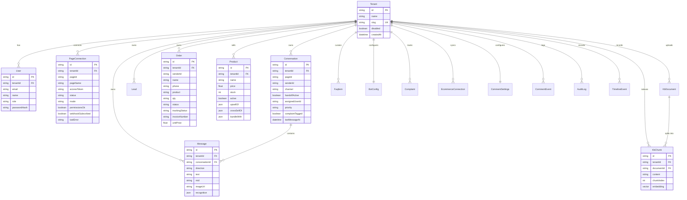
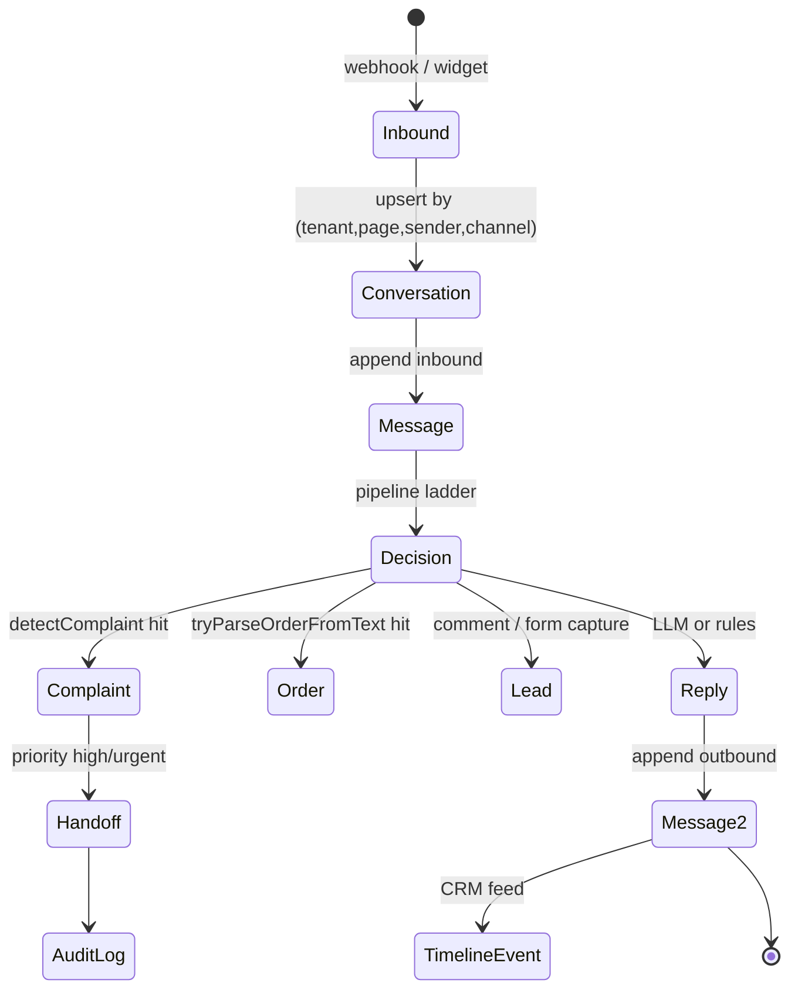

# 03 · Data model

> 🧑‍💻 ENG · 🔐 SEC · 🔬 QA

Source of truth: [`prisma/schema.prisma`](../../prisma/schema.prisma).
Engine: PostgreSQL with the `vector` extension (`previewFeatures = ["postgresqlExtensions"]`).

---

## 3.1 Entity-relationship diagram



---

## 3.2 Table catalogue

18 models. Every business model has `tenantId` with `onDelete: Cascade`.

| # | Model | Purpose | Cardinality per tenant | Hot path |
| --- | --- | --- | --- | --- |
| 1 | `Tenant` | Root of isolation | 1 | tenant resolve |
| 2 | `User` | Dashboard account + RBAC | 1–20 | login |
| 3 | `PageConnection` | Facebook Page binding | 0–N | webhook tenant resolve |
| 4 | `Conversation` | Thread per (page, sender, channel) | 100s–10,000s | every inbound |
| 5 | `Message` | Every inbound/outbound turn | 10× conversations | every inbound |
| 6 | `Lead` | CRM record | 100s | lead capture |
| 7 | `Order` | COD order + tracking | 100s | order capture / tracking |
| 8 | `Product` | Catalog with relations | 10s–1,000s | **every AI reply** |
| 9 | `KbDocument` | Uploaded knowledge source | 1–100 | KB admin |
| 10 | `KbChunk` | Embedded chunk (pgvector) | 100s–10,000s | **every AI reply** |
| 11 | `FaqItem` | Curated Q/A | 10s | every AI reply |
| 12 | `BotConfig` | Prompt, greeting, guardrails | 1 | **every AI reply** |
| 13 | `Complaint` | Triaged complaint | 10s | complaint path |
| 14 | `EcommerceConnection` | External store credentials | 0–5 | sync |
| 15 | `CommentSettings` | Comment AI configuration | 1 | comment path |
| 16 | `CommentEvent` | Processed comment log | 100s | comment path |
| 17 | `AuditLog` | Who did what | 1,000s | writes only |
| 18 | `TimelineEvent` | Customer/lead activity feed | 1,000s | CRM view |

---

## 3.3 Detailed schemas

### `Tenant`

| Column | Type | Constraint | Notes |
| --- | --- | --- | --- |
| `id` | `String` | PK | Application-generated (`newId`) |
| `name` | `String` | — | Display name |
| `slug` | `String` | **UNIQUE** | URL-safe key |
| `disabled` | `Boolean` | default `false` | Blocks `authenticateUser` |
| `createdAt` | `DateTime` | default `now()` | — |

### `User`

| Column | Type | Constraint |
| --- | --- | --- |
| `id` | `String` | PK |
| `tenantId` | `String` | FK → `Tenant.id` cascade |
| `email` | `String` | unique **within tenant** |
| `role` | `String` | `admin` \| `manager` \| `moderator` \| `agent` |
| `passwordHash` | `String` | bcrypt, cost 10, must start `$2` |

```
@@unique([tenantId, email])
@@index([tenantId])
```

> 🔐 **Note.** `authenticateUser` looks the user up with
> `prisma.user.findFirst({ where: { email } })` — **globally**, not scoped to a
> tenant. Because email is only unique *per tenant*, the same email registered in
> two tenants resolves non-deterministically to whichever row the planner returns
> first. Tracked as **GAP-10**.

### `PageConnection`

| Column | Type | Values / notes |
| --- | --- | --- |
| `pageId` | `String` | Facebook Page ID (or `demo_page_<ts>`) |
| `accessToken` | `String?` | **stored in plaintext** — GAP-11 |
| `status` | `String` | `active` \| `pending` \| `disconnected` \| `error` |
| `mode` | `String` | `demo` \| `oauth` |
| `permissionsOk` | `Boolean` | never set `true` on the OAuth path — GAP-02 |
| `webhookSubscribed` | `Boolean` | never set `true` anywhere — GAP-01 |
| `lastError` | `String?` | human-readable failure reason |

```
@@index([tenantId])
@@index([pageId, status])   ← used by resolveTenantIdForPage
```

The API layer redacts the token: `mapPage()` returns `"[redacted]"` rather than
the value. The database still holds it in the clear.

### `Conversation`

```
@@unique([tenantId, pageId, senderId, channel])   ← idempotent upsert key
@@index([tenantId, lastMessageAt])                ← inbox ordering
@@index([tenantId, senderId])                     ← handoff lookup
```

| Column | Meaning |
| --- | --- |
| `channel` | `messenger` (default) \| `web` |
| `handoffActive` | `true` → the pipeline stops replying |
| `assignedUserId` | Agent who took the thread |
| `priority` | Derived from complaint severity |
| `complaintTagged` | Surfaces the thread in the complaint queue |

### `Message`

| Column | Meaning |
| --- | --- |
| `direction` | `inbound` \| `outbound` |
| `mid` | Meta message id — **the deduplication key** |
| `imageUrl` | Attachment URL from Meta |
| `recognition` | `Json?` — `{productId, productName, confidence, similarIds, method}` |

```
@@index([tenantId, conversationId, createdAt])
```

> ⚠️ There is **no unique index on `mid`**. Deduplication is a read-then-write
> (`messageExistsByMid` → `appendMessage`), which is racy under concurrent
> redelivery. Tracked as **GAP-04**.

### `Order`

| Column | Values |
| --- | --- |
| `status` | `new` (default) → business-defined |
| `trackingStatus` | `new` (default) → `confirmed` → `packed` → `shipped` → `delivered` / `returned` |
| `invoiceNumber` | Assigned by `storeOrder` via `db/invoice.ts` |
| `qty` | **`String`**, not `Int` — free-text tolerant, see note |
| `unitPrice` | `Float?` — copied from catalog when the product matches |

```
@@index([tenantId, createdAt])
@@index([tenantId, senderId])   ← "where is my order" by sender
@@index([tenantId, phone])      ← "where is my order" by phone
@@index([tenantId, trackingStatus])
```

> `qty` is a `String` because buyers write "2 ta", "দুইটা", "2pcs". Aggregation on
> quantity therefore requires parsing. Tracked as **GAP-13**.

### `Product`

| Column | Notes |
| --- | --- |
| `price` | `Float` — BDT |
| `stock` | `Int` — `getRecommendations` filters `stock > 0` |
| `active` | `Boolean` — inactive products never reach the prompt |
| `upsellOf`, `crossSellOf`, `bundleWith` | `Json?` arrays of product ids |
| `sku`, `externalId`, `sourcePlatform` | External store sync keys |

```
@@index([tenantId, active])
```

### `KbChunk` — the vector table

| Column | Type |
| --- | --- |
| `content` | `String` — up to 800 chars |
| `chunkIndex` | `Int` — order within the document |
| `embedding` | `Unsupported("vector")?` — **nullable by design** |

`embedding` is null when no embedding API is available; retrieval then falls back
to keyword scoring. Dimension constant `EMBED_DIM = 1536` lives in `db/rag.ts`.

```
@@index([tenantId, documentId])
```

> ⚠️ There is **no vector index** (`ivfflat` / `hnsw`). Similarity search is a
> sequential scan over the tenant's chunks. Fine at 10³ chunks, quadratic pain at
> 10⁵. Tracked as **GAP-14** with the fix in §3.7.

### `BotConfig` — one row per tenant (PK *is* `tenantId`)

| Column | Purpose |
| --- | --- |
| `systemPrompt` | Injected verbatim (sanitised) into the LLM system message |
| `greeting` | Rules-path greeting and fallback |
| `productFaq` | Legacy inline knowledge, still used when RAG returns nothing |
| `personality` | Prompt Builder sales-tone blurb |
| `handoffEnabled` | Master switch for human takeover |
| `abandonedLeadHours` | Default 24 — follow-up window |
| `guardrailRules` | `Json?` — see below |

`guardrailRules` shape (defaults in `db/types.ts` as `DEFAULT_GUARDRAIL_RULES`):

```jsonc
{
  "neverInventStock":      true,
  "collectPhone":          true,
  "confirmOrder":          true,
  "escalateRefund":        true,
  "escalateLegal":         true,
  "escalateAngry":         true,
  "escalateLowConfidence": true,
  "confidenceThreshold":   0.7
}
```

### `AuditLog` / `TimelineEvent`

| `AuditLog` column | Purpose |
| --- | --- |
| `actorId`, `actorEmail` | Who — null for system actions |
| `action` | Dotted verb: `team.user_create`, `tenant.disable`, `echo_handoff` |
| `entityType`, `entityId` | What |
| `meta` | `Json?` — full event payload |

| `TimelineEvent` column | Purpose |
| --- | --- |
| `senderId` / `leadId` | Subject of the timeline |
| `type`, `title`, `body` | Renderable feed item |
| `refId` | Order / complaint / message id |

---

## 3.4 Index inventory

| Table | Index | Serves |
| --- | --- | --- |
| `Tenant` | `slug` unique | slug lookup |
| `User` | `(tenantId, email)` unique · `(tenantId)` | login, team list |
| `PageConnection` | `(tenantId)` · `(pageId, status)` | connect list, **webhook tenant resolve** |
| `Conversation` | `(tenantId, pageId, senderId, channel)` unique · `(tenantId, lastMessageAt)` · `(tenantId, senderId)` | upsert, inbox, handoff |
| `Message` | `(tenantId, conversationId, createdAt)` | thread render |
| `Lead` | `(tenantId, createdAt)` · `(tenantId, crmStage)` | CRM board |
| `Order` | `(tenantId, createdAt)` · `(tenantId, senderId)` · `(tenantId, phone)` · `(tenantId, trackingStatus)` | tracking answers |
| `Product` | `(tenantId, active)` | catalog for prompt |
| `KbDocument` | `(tenantId, createdAt)` | KB list |
| `KbChunk` | `(tenantId, documentId)` | re-index / delete |
| `FaqItem` | `(tenantId)` | FAQ blob |
| `Complaint` | `(tenantId, createdAt)` | complaint queue |
| `EcommerceConnection` | `(tenantId, platform)` unique · `(tenantId)` | one connection per platform |
| `CommentEvent` | `(tenantId, createdAt)` | comment log |
| `AuditLog` | `(tenantId, createdAt)` | audit view |
| `TimelineEvent` | `(tenantId, senderId, createdAt)` · `(tenantId, leadId, createdAt)` | CRM timeline |

### Missing indexes worth adding

| Proposed | Rationale |
| --- | --- |
| `Message(tenantId, mid)` **unique, partial where mid is not null** | Makes dedupe atomic (GAP-04) |
| `KbChunk USING hnsw (embedding vector_cosine_ops)` | Vector search (GAP-14) |
| `Conversation(tenantId, handoffActive)` | Fast "threads needing a human" |
| `Lead(tenantId, followUpQueuedAt)` | Follow-up sweeper |

---

## 3.5 Constraints and invariants

| Invariant | Enforced by | Enforced where |
| --- | --- | --- |
| A conversation is unique per (tenant, page, sender, channel) | DB unique index | Postgres |
| A user email is unique per tenant | DB unique index | Postgres |
| One `BotConfig` per tenant | PK = `tenantId` | Postgres |
| One `EcommerceConnection` per (tenant, platform) | DB unique index | Postgres |
| Deleting a tenant deletes everything | `onDelete: Cascade` | Postgres |
| Password hashes are bcrypt | `verifyPassword` rejects non-`$2` | Application |
| Session role ∈ known set | `decodeSession` checks `role in ROLE_RANK` | Application |
| Embeddings contain only finite numbers | `vectorLiteral` throws otherwise | Application |
| A message is processed once | `messageExistsByMid` | Application ⚠️ racy |
| Cross-tenant public writes are impossible | `resolvePublicTenantId` | Application |

---

## 3.6 Data lifecycle



### Retention policy (proposed, **not implemented** — GAP-15)

| Data | Proposed retention | Reason |
| --- | --- | --- |
| `Message` | 90 days | Chat transcripts are the biggest PII surface |
| `Conversation` | 90 days after last message | Follows messages |
| `Order` | 24 months | Accounting / dispute window |
| `Lead` | 12 months after last touch | CRM value decays |
| `AuditLog` | 24 months | Compliance |
| `KbChunk` | Until document deleted | Derived data |
| `CommentEvent` | 90 days | Moderation log |

---

## 3.7 Migration recipes

### Add the vector index (fixes GAP-14)

```sql
-- Requires pgvector >= 0.5 for HNSW.
CREATE INDEX CONCURRENTLY kbchunk_embedding_hnsw
  ON "KbChunk"
  USING hnsw (embedding vector_cosine_ops)
  WITH (m = 16, ef_construction = 64);

-- Then, per session:
SET hnsw.ef_search = 40;
```

### Make message dedupe atomic (fixes GAP-04)

```sql
CREATE UNIQUE INDEX CONCURRENTLY message_tenant_mid_uniq
  ON "Message" ("tenantId", mid)
  WHERE mid IS NOT NULL;
```

Then replace read-then-write with an upsert and treat a unique violation
(`P2002`) as `duplicate_mid_skipped`.

### Encrypt page tokens at rest (fixes GAP-11)

```prisma
model PageConnection {
  accessTokenCiphertext Bytes?
  accessTokenIv         Bytes?
  accessTokenTag        Bytes?
  accessTokenKeyVersion Int?    @default(1)
}
```

Encrypt with AES-256-GCM using a key from `TOKEN_ENCRYPTION_KEY`; keep
`accessToken` during a dual-write window, then drop it.

---

## 3.8 Seeding and migration scripts

| Command | Script | Effect |
| --- | --- | --- |
| `npm run db:push` | Prisma | Push schema without a migration file |
| `npm run db:migrate` | Prisma | Create + apply a migration |
| `npm run seed` | `scripts/seed.ts` | Demo tenant, admin user, catalog, FAQ |
| `npm run db:migrate-json` | `scripts/migrate-json.ts` | One-shot import of the legacy `data/facetai-db.json` |

Demo credentials after seeding: `admin@demo.replypilot.local` /
`$ADMIN_PASSWORD` (falls back to `facetai-demo` outside production).

---

**Next:** [`04-api-reference.md`](./04-api-reference.md)
