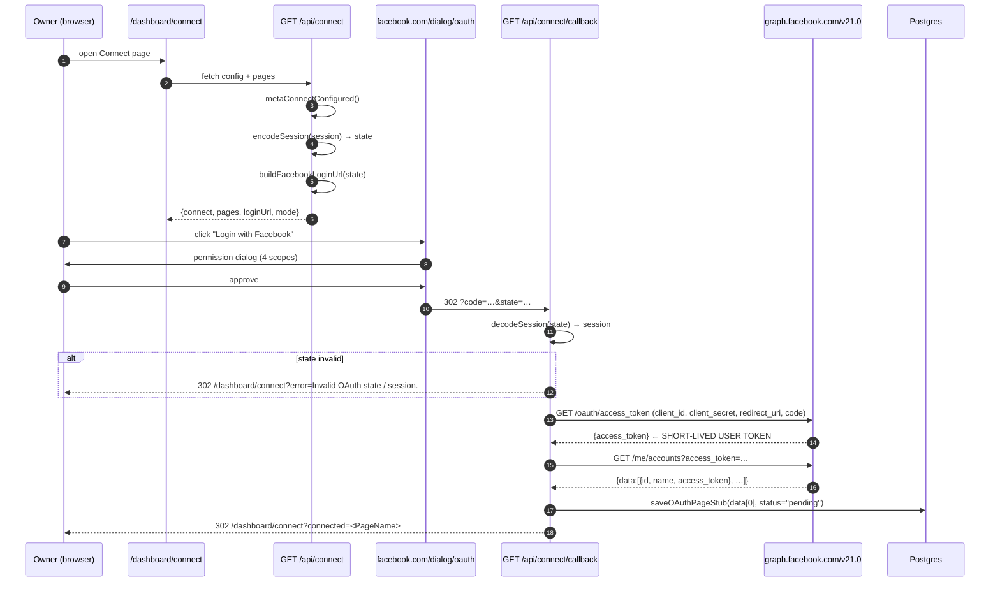
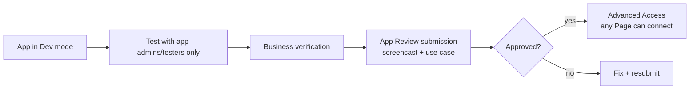
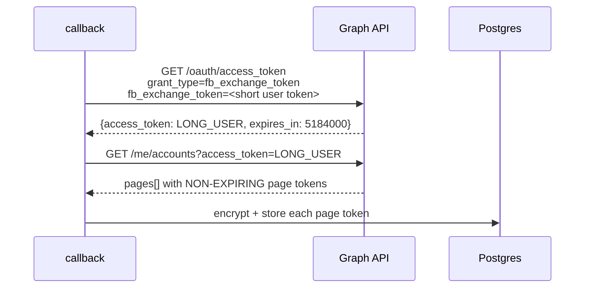
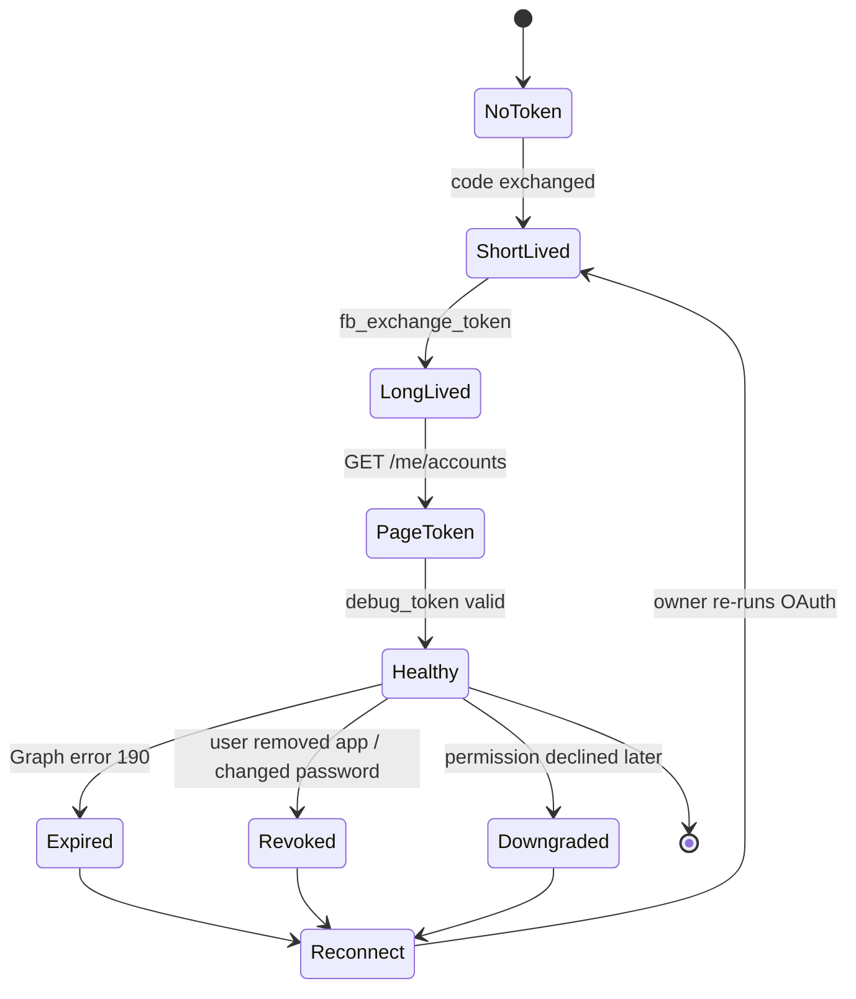
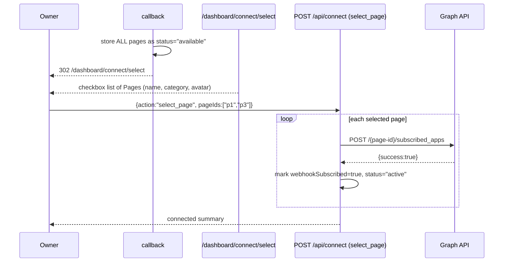
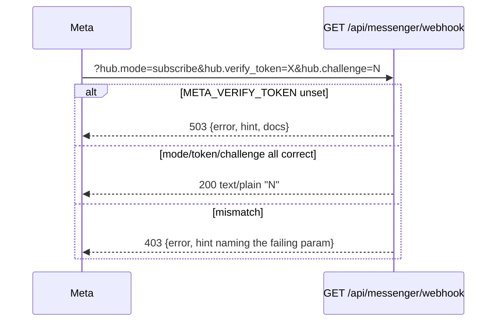
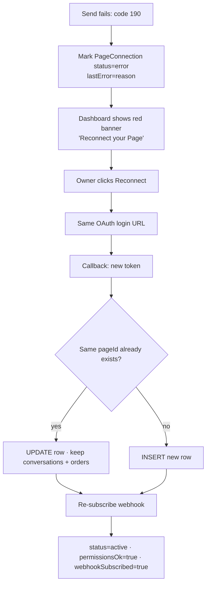
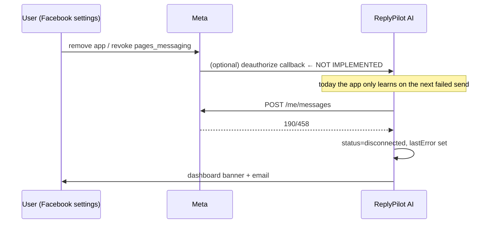
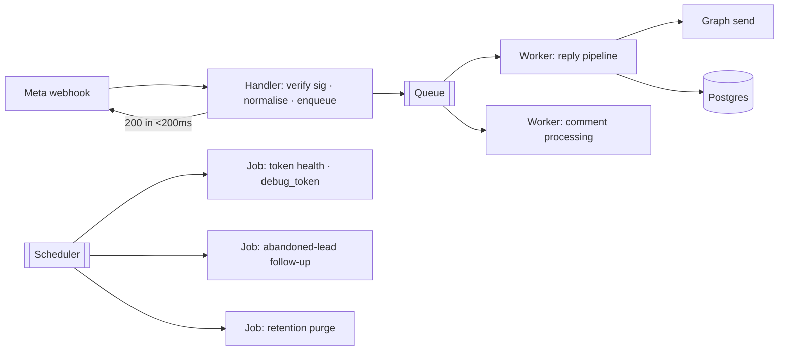

# 05 · Facebook Messenger & Connect

> 🧑‍💻 ENG · 📦 PM · 🔬 QA · 🔐 SEC

This is the deepest chapter in the handbook because it is the highest-risk
integration. It documents **what runs today**, **what is scaffolded**, and
**exactly what must be built** to reach production parity with Meta's
requirements.

---

## 5.0 Implementation status board

| # | Capability | Status | Where |
| --- | --- | --- | --- |
| 1 | OAuth login URL construction | 🟢 SHIPPED | `db/auth.ts · buildFacebookLoginUrl` |
| 2 | Authorization-code → user token exchange | 🟢 SHIPPED | `api/connect/callback` |
| 3 | Page list fetch (`/me/accounts`) | 🟢 SHIPPED | `api/connect/callback` |
| 4 | **Page selection UI (multi-page)** | 🔴 **MISSING — stores `data[0]` only** | GAP-03 |
| 5 | **Short → long-lived token exchange** | 🔴 **MISSING** | GAP-17 |
| 6 | **Webhook subscription (`/{page-id}/subscribed_apps`)** | 🔴 **MISSING** | GAP-01 |
| 7 | **Permission verification (`/me/permissions`)** | 🔴 **MISSING** | GAP-02 |
| 8 | Webhook verification handshake (`GET`) | 🟢 SHIPPED | `api/messenger/webhook` |
| 9 | `X-Hub-Signature-256` verification | 🟢 SHIPPED | `bot/messenger.ts` |
| 10 | Event normalisation (message, postback, echo, image) | 🟢 SHIPPED | `normalizeMessagingEvents` |
| 11 | Redelivery dedupe by `mid` | 🟡 PARTIAL (racy) | GAP-04 |
| 12 | Page → tenant resolution | 🟢 SHIPPED | `resolveTenantIdForPage` |
| 13 | Text + image send | 🟢 SHIPPED | `sendTextMessage` / `sendImageMessage` |
| 14 | **Per-page token used when sending** | 🔴 **MISSING — uses global env token** | GAP-18 |
| 15 | Token-expiry / revocation handling | 🔴 MISSING | GAP-19 |
| 16 | Reconnect flow | 🟡 PARTIAL (re-run OAuth) | GAP-20 |
| 17 | 24-hour window / message tags | 🔴 MISSING | GAP-21 |
| 18 | Handover Protocol (`standby`, `pass_thread_control`) | 🔴 MISSING | GAP-22 |
| 19 | Queue / background workers | 🔴 MISSING | GAP-05 |

> **Bottom line for a launch decision:** items 4, 5, 6, 7 and 14 must ship before
> a second tenant can connect a real Page. Today, live Messenger traffic works
> only for the single Page whose token is in `META_PAGE_ACCESS_TOKEN`.

---

## 5.1 OAuth flow — as implemented



### The OAuth request

```
https://www.facebook.com/v21.0/dialog/oauth
  ?client_id=<META_APP_ID>
  &redirect_uri=<META_REDIRECT_URI>
  &state=<facetai_session JWT>
  &scope=pages_show_list,pages_messaging,pages_manage_metadata,pages_read_engagement
  &response_type=code
```

### Scope inventory

| Scope | Needed for | App Review |
| --- | --- | --- |
| `pages_show_list` | Enumerate the user's Pages | Standard |
| `pages_messaging` | Send and receive DMs | **Advanced Access required** |
| `pages_manage_metadata` | Subscribe the app to Page webhooks | **Advanced Access required** |
| `pages_read_engagement` | Read Page content / comments | Advanced Access |
| `pages_manage_engagement` | *(not requested)* delete / reply to comments | Required for live Comment AI |
| `business_management` | *(not requested)* Business Manager assets | Required for embedded signup |

> 📦 **PM action:** Comment AI cannot go live without adding
> `pages_manage_engagement` to this list **and** passing App Review with a
> screencast showing the moderation use case.

### State parameter — security analysis

The `state` value is the caller's own signed session JWT.

| Property | Assessment |
| --- | --- |
| Unforgeable | ✅ HS256-signed with `SESSION_SECRET` |
| Binds callback to the initiating user | ✅ decoded back into a `SessionPayload` |
| Single-use / nonce | ❌ replayable for the token's 14-day life |
| Bound to a specific connect attempt | ❌ no `attemptId` |
| Leaks data | ⚠️ the JWT lands in Facebook's redirect logs and browser history |

**Recommended hardening (GAP-23):**

```ts
// issue
const nonce = crypto.randomUUID();
await prisma.oauthState.create({
  data: { nonce, tenantId, userId, expiresAt: addMinutes(new Date(), 10) },
});
const state = base64url(JSON.stringify({ nonce }));

// verify — delete on read, so it is single-use
const row = await prisma.oauthState.delete({ where: { nonce } }).catch(() => null);
if (!row || row.expiresAt < new Date()) return redirectWithError("Invalid OAuth state.");
```

---

## 5.2 Permission flow

### What Meta requires



### What the code should check after OAuth (not yet implemented — GAP-02)

```ts
const res = await fetch(
  `https://graph.facebook.com/v21.0/me/permissions?access_token=${userToken}`,
);
const { data } = await res.json();
// data: [{ permission: "pages_messaging", status: "granted" | "declined" }, …]

const REQUIRED = [
  "pages_show_list",
  "pages_messaging",
  "pages_manage_metadata",
  "pages_read_engagement",
];
const granted = new Set(
  data.filter((p) => p.status === "granted").map((p) => p.permission),
);
const missing = REQUIRED.filter((p) => !granted.has(p));

await prisma.pageConnection.update({
  where: { id: pageRowId },
  data: {
    permissionsOk: missing.length === 0,
    lastError: missing.length ? `Missing permissions: ${missing.join(", ")}` : null,
    status: missing.length ? "error" : "active",
  },
});
```

The `PageConnection.permissionsOk` column already exists for exactly this — it is
simply never written to `true` on the OAuth path.

---

## 5.3 Token lifecycle

### The four tokens

| Token | Lifetime | Where it lives today |
| --- | --- | --- |
| Short-lived **user** token | ~1 hour | in-memory during the callback, then discarded |
| Long-lived **user** token | ~60 days | ❌ never obtained |
| **Page** access token (from a short-lived user token) | ~1 hour | stored in `PageConnection.accessToken` |
| **Page** access token (from a long-lived user token) | never expires* | ❌ never obtained |

\* Non-expiring in practice, but invalidated by password change, permission
revocation, app removal, or Meta security action.

> 🔴 **GAP-17 — this is the single most important bug in Connect.**
> The callback stores the Page token derived from a **short-lived** user token.
> It stops working roughly one hour after connection, and nothing detects that.

### The exchange that must be added



```ts
const ex = new URL("https://graph.facebook.com/v21.0/oauth/access_token");
ex.searchParams.set("grant_type", "fb_exchange_token");
ex.searchParams.set("client_id", process.env.META_APP_ID!);
ex.searchParams.set("client_secret", process.env.META_APP_SECRET!);
ex.searchParams.set("fb_exchange_token", shortLivedUserToken);
const { access_token: longUserToken, expires_in } = await (await fetch(ex)).json();
```

### Token state machine



### Token health check (recommended daily job)

```ts
const res = await fetch(
  `https://graph.facebook.com/v21.0/debug_token` +
  `?input_token=${pageToken}&access_token=${appId}|${appSecret}`,
);
const { data } = await res.json();
// data.is_valid, data.expires_at, data.scopes, data.error
```

Map the result onto `PageConnection`:

| `debug_token` result | `status` | `lastError` |
| --- | --- | --- |
| `is_valid: true`, all scopes present | `active` | `null` |
| `is_valid: true`, scopes missing | `error` | `Missing permissions: …` |
| `is_valid: false`, code 190 subcode 463 | `error` | `Token expired — reconnect required` |
| `is_valid: false`, code 190 subcode 458 | `disconnected` | `App removed by user` |
| `is_valid: false`, code 190 subcode 460 | `error` | `Password changed — reconnect required` |

---

## 5.4 Page selection & multi-page support

### Current behaviour (GAP-03)

```ts
const first = pagesJson.data?.[0];      // ← only the first Page, silently
await saveOAuthPageStub({ pageId: first.id, pageName: first.name, … });
```

A user managing five Pages connects exactly one, chosen arbitrarily by Graph's
ordering, with no UI feedback.

### Target flow



### Multi-page routing at runtime

Inbound routing already works correctly:

```ts
// resolveTenantIdForPage — uses the (pageId, status) index
const page = await prisma.pageConnection.findFirst({
  where: { pageId, status: "active" },
});
return page?.tenantId || DEFAULT_TENANT_ID;
```

Outbound routing does **not** (GAP-18):

```ts
// bot/messenger.ts — the pageAccessToken argument is never passed by the pipeline
export async function sendTextMessage(recipientId, text, pageAccessToken?) {
  const token = pageAccessToken || getPageAccessToken();  // ← env fallback wins
  …
}
```

**Fix:** thread the resolved page token from `handleInboundMessage` into every
send. Sketch:

```ts
// pipeline.ts
const page = await getActivePage(tenantId, inbound.pageId);
const pageToken = page ? await decryptToken(page) : undefined;
await sendTextMessage(inbound.senderId, ai.text, pageToken);
```

Until this lands, two tenants sharing one deployment both send from the single
Page identified by `META_PAGE_ACCESS_TOKEN` — a cross-tenant messaging leak.

---

## 5.5 Webhook registration

### What must happen (GAP-01)

```http
POST https://graph.facebook.com/v21.0/{page-id}/subscribed_apps
  ?subscribed_fields=messages,messaging_postbacks,message_echoes,messaging_optins,messaging_referrals,message_deliveries,message_reads,feed
  &access_token={page-access-token}
```

| Field | Why ReplyPilot AI needs it |
| --- | --- |
| `messages` | Core inbound text/attachments |
| `messaging_postbacks` | Button/menu taps — `normalizeMessagingEvents` already reads `postback.payload` |
| `message_echoes` | **Required** for the human-handoff detection to work |
| `messaging_referrals` | m.me ref / ad click attribution |
| `message_deliveries`, `message_reads` | Delivery + read analytics |
| `feed` | Comment AI (needs `pages_manage_engagement` too) |

Verify with:

```http
GET /v21.0/{page-id}/subscribed_apps?access_token={page-access-token}
```

### App-level configuration (Meta dashboard, one-time)

| Setting | Value |
| --- | --- |
| Callback URL | `https://<domain>/api/messenger/webhook` |
| Verify Token | the exact value of `META_VERIFY_TOKEN` |
| Subscribed fields | as above |
| App Secret | copied to `META_APP_SECRET` |

---

## 5.6 Webhook verification (`GET`)



The `503` body is deliberately instructive:

```json
{
  "ok": false,
  "error": "META_VERIFY_TOKEN is not set",
  "hint": "Copy .env.example → .env.local, set META_VERIFY_TOKEN to a long random string, restart the server, then use the same value as Verify Token in Meta → Messenger → Webhooks.",
  "docs": "See README § Environment variables and docs/QA-REPORT.md Meta webhook steps."
}
```

---

## 5.7 Signature verification (`POST`)

```
expected = HMAC_SHA256(rawBody, META_APP_SECRET)  →  hex
received = header.slice("sha256=".length)
equal    = timingSafeEqual(Buffer(expected,'hex'), Buffer(received,'hex'))
```

| Condition | Result |
| --- | --- |
| No `META_APP_SECRET`, `NODE_ENV !== "production"` | **accepted** (local fixture replay) |
| No `META_APP_SECRET`, production | **rejected 401** |
| Header missing or not `sha256=…` | rejected 401 |
| Length mismatch | rejected 401 (before `timingSafeEqual`, which throws on unequal lengths) |
| Hex parse failure | rejected 401 (caught) |

Critically, the handler reads `await request.text()` **first** and verifies the
raw string. Verifying a re-serialised `JSON.stringify(body)` would fail on
whitespace and key-order differences — a classic integration bug this codebase
avoids.

---

## 5.8 Message event → normalised envelope

```ts
type InboundMessage = {
  senderId: string;      // PSID of the human
  pageId?: string;       // entry.id
  mid?: string;          // dedupe key
  text?: string;         // message.text ?? postback.payload ?? postback.title
  imageUrl?: string;     // first attachment of type "image"
  isEcho?: boolean;      // message.is_echo
  timestamp?: number;
};
```

### Echo handling — the subtle part

```ts
const isEcho = Boolean(event.message?.is_echo);
// On an echo, sender is the PAGE and recipient is the USER.
// Handoff state is keyed on the USER, so flip the ids.
const userId = isEcho ? event.recipient?.id : event.sender?.id;
```

Getting this backwards would key handoff on the Page id, so one human reply
would mute the bot for *every* customer. The code handles it correctly.

### Event coverage matrix

| Meta event | Normalised? | Pipeline behaviour |
| --- | --- | --- |
| `message.text` | ✅ | full ladder |
| `message.attachments[image]` | ✅ | product match → vision → stub |
| `message.attachments[video/audio/file]` | ⚠️ ignored | treated as empty → `reason: empty` |
| `message.quick_reply` | ❌ not read | falls back to `text` if present |
| `postback` | ✅ `payload` → `title` | treated as text |
| `message.is_echo` | ✅ | enables handoff + audit |
| `messaging_optins` | ❌ | dropped |
| `messaging_referrals` | ❌ | dropped (loses ad attribution) |
| `message_deliveries` / `message_reads` | ❌ | dropped (no delivery analytics) |
| `messaging_handovers` | ❌ | dropped |
| `object !== "page"` | ✅ | returns `[]` — Instagram payloads ignored |

---

## 5.9 Reply event (outbound)

```http
POST https://graph.facebook.com/v21.0/me/messages
Authorization: Bearer <page access token>
Content-Type: application/json

{
  "recipient":     { "id": "<PSID>" },
  "messaging_type":"RESPONSE",
  "message":       { "text": "<reply, truncated to 1900 chars>" }
}
```

Image variant:

```json
{
  "recipient": { "id": "<PSID>" },
  "messaging_type": "RESPONSE",
  "message": { "attachment": { "type": "image",
               "payload": { "url": "<https url>", "is_reusable": true } } }
}
```

| Behaviour | Implementation |
| --- | --- |
| Text cap | `text.slice(0, 1900)` — Meta's limit is 2000 |
| No token | returns `{ok:false, skipped:true, error:"missing_page_token"}`, pipeline logs `Would reply:` and returns `reply_skipped_no_token` |
| Graph error | logs status + first 400 chars, returns `{ok:false, error}` — **not retried** |
| Typing indicator | ❌ not sent (GAP-24) |
| Message tags | ❌ never used (GAP-21) |

> 🔴 **GAP-21 — the 24-hour window.** `messaging_type: "RESPONSE"` is only valid
> within 24 hours of the customer's last message. Any reply outside that window
> (e.g. a delayed abandoned-lead follow-up) is rejected by Meta with error 10
> subcode 2018278 unless it carries a `MESSAGE_TAG` such as
> `POST_PURCHASE_UPDATE`, `ACCOUNT_UPDATE`, or `CONFIRMED_EVENT_UPDATE`. Since
> `Lead.followUpQueuedAt` exists in the schema, this will bite the moment
> follow-ups ship.

### Recommended send wrapper

```ts
async function sendWithRetry(fn: () => Promise<Response>, attempts = 3) {
  for (let i = 0; i < attempts; i++) {
    const res = await fn();
    if (res.ok) return res;
    const { error } = await res.clone().json().catch(() => ({ error: {} }));
    if (error?.code === 190) throw new TokenInvalid(error);      // no retry
    if (error?.code === 10)  throw new OutsideWindow(error);     // no retry
    if (res.status >= 500 || error?.code === 613) {              // 613 = rate limit
      await sleep(2 ** i * 500 + Math.random() * 250);
      continue;
    }
    throw new GraphError(error);
  }
}
```

---

## 5.10 Graph API error catalogue

| Code | Subcode | Meaning | Correct response |
| --- | --- | --- | --- |
| 190 | 458 | App removed by user | `status = disconnected`, prompt reconnect |
| 190 | 460 | Password changed | `status = error`, prompt reconnect |
| 190 | 463 | Token expired | `status = error`, prompt reconnect |
| 190 | 467 | Token invalid | `status = error`, prompt reconnect |
| 10 | 2018278 | Outside 24-hour window | Use a message tag or drop |
| 10 | 2018108 | Not allowed to message this user | Mark thread undeliverable |
| 100 | 2018001 | No matching user found | Stale PSID — archive thread |
| 200 | — | Permission missing | Re-request scope, `permissionsOk = false` |
| 613 | — | Calls-per-second exceeded | Exponential backoff |
| 4 | — | App-level rate limit | Backoff + alert |
| 368 | — | Temporarily blocked for policy violation | Alert operator, pause sends |
| 551 | — | User unavailable | Archive thread |

---

## 5.11 Failure and recovery flows

### Reconnect flow



> 🟡 **GAP-20.** `saveOAuthPageStub` always `create`s. Reconnecting the same Page
> produces duplicate `PageConnection` rows, and `resolveTenantIdForPage` uses
> `findFirst({ pageId, status: "active" })` — so which row wins is undefined.
> Fix: add `@@unique([tenantId, pageId])` and switch to `upsert`.

### Permission-revoked flow



**To implement:** register a Deauthorize Callback URL in the Meta app settings
pointing at `POST /api/connect/deauthorize`, verify the signed request, and mark
every `PageConnection` for that user id as `disconnected`.

### Token-expired flow

Because tokens today are short-lived (GAP-17), this is the *expected* path
roughly one hour after any real OAuth connect:

```
t+0min   connect succeeds, status="pending"
t+60min  Page token silently expires
t+61min  customer messages → resolveTenantIdForPage finds no ACTIVE page
         → falls back to DEFAULT_TENANT_ID
         → reply is generated from the WRONG tenant's config
         → send uses META_PAGE_ACCESS_TOKEN (a different Page) or is skipped
```

That chain — expired token → default-tenant fallback → wrong-tenant prompt — is
the most dangerous compound failure in the system. Fix order: GAP-17, then
GAP-18, then reconsider whether `resolveTenantIdForPage` should fall back to the
default tenant at all, or refuse to answer.

**Recommended:**

```ts
export async function resolveTenantIdForPage(pageId?: string): Promise<string | null> {
  if (!pageId) return null;
  const page = await prisma.pageConnection.findFirst({
    where: { pageId, status: "active" },
  });
  if (!page) {
    console.warn(`[pipeline] unmapped pageId=${pageId} — refusing to answer`);
    return null;                       // caller returns {handled:false, reason:"unmapped_page"}
  }
  return page.tenantId;
}
```

---

## 5.12 Queue processing & background workers

### Today: none

```
Meta ──POST──▶ [handler] ──▶ pipeline ──▶ LLM (≤30s) ──▶ Graph send ──▶ 200 OK
                                └── everything is inside the request
```

Consequences:

| Risk | Detail |
| --- | --- |
| Meta timeout | Meta expects ~20 s; `AI_TIMEOUT_MS` alone is 30 s |
| Retry storm | On timeout Meta redelivers; dedupe is racy (GAP-04) |
| Head-of-line blocking | A batch of 10 events in one payload is processed serially |
| No follow-ups | `Lead.followUpQueuedAt` / `followUpSentAt` exist with nothing to drain them |
| No token refresh job | GAP-17 cannot be fixed without a scheduler |

### Target: queue + workers



| Job | Trigger | Idempotency key |
| --- | --- | --- |
| `reply.generate` | webhook enqueue | `mid` |
| `comment.process` | `feed` webhook | `commentId` |
| `token.health` | cron hourly | `pageConnectionId` |
| `lead.followup` | cron every 15 min | `leadId` |
| `retention.purge` | cron nightly | date bucket |
| `ecommerce.sync` | cron + manual | `connectionId` |

**Recommended stack on Vercel:** Vercel Queues (public beta, built on Fluid
Compute) for `reply.generate`, and Vercel Cron for the scheduled jobs. On a
self-hosted Node host, BullMQ + Redis behind the same interface.

Minimum viable improvement without any queue infrastructure:

```ts
export async function POST(request: Request) {
  const rawBody = await request.text();
  if (!verifyMetaSignature(rawBody, request.headers.get("x-hub-signature-256"))) {
    return NextResponse.json({ ok: false, error: "Invalid signature." }, { status: 401 });
  }
  const events = normalizeMessagingEvents(JSON.parse(rawBody));
  // Acknowledge immediately; process after the response is sent.
  after(async () => {
    for (const e of events) {
      try { await handleInboundMessage(e); }
      catch (err) { console.error("[webhook] handle error:", err); }
    }
  });
  return NextResponse.json({ ok: true, accepted: events.length });
}
```

(`after` from `next/server` runs work after the response flushes — a two-line
change that removes the Meta-timeout class of bugs entirely, at the cost of the
debug-friendly `results` array.)

---

## 5.13 Multi-tenant Messenger model

```
Tenant A ── PageConnection(pageId=111, active) ─┐
Tenant B ── PageConnection(pageId=222, active) ─┼─▶ one webhook URL
Tenant B ── PageConnection(pageId=333, active) ─┘   /api/messenger/webhook
                                                          │
                             entry[].id ──▶ resolveTenantIdForPage ──▶ tenantId
```

| Requirement | Status |
| --- | --- |
| One webhook URL for all tenants | 🟢 works |
| Inbound routed by `entry.id` | 🟢 works |
| Outbound sent from the right Page | 🔴 GAP-18 |
| One tenant's prompt never leaks to another | 🟢 for web/API (`resolvePublicTenantId`) · 🔴 via the unmapped-page fallback |
| Per-tenant AI budget | 🟢 `ai-budget:<tenantId>` (single-instance only) |
| Per-tenant Page limits | 🔴 unlimited |

---

## 5.14 QA test matrix

| # | Scenario | Setup | Expected |
| --- | --- | --- | --- |
| 1 | Verification happy path | correct token | `200` + challenge echoed as text/plain |
| 2 | Verification wrong token | wrong token | `403`, hint = "does not match" |
| 3 | Verification token unset | unset env | `503` with setup hint |
| 4 | Valid signature | HMAC of raw body | `200 {ok:true}` |
| 5 | Tampered body | body altered post-signing | `401` |
| 6 | Missing signature in prod | `NODE_ENV=production` | `401` |
| 7 | Missing signature in dev | no `META_APP_SECRET` | `200` (accepted) |
| 8 | Malformed JSON | `"{"` | `400 Invalid JSON.` |
| 9 | Non-page object | `{"object":"instagram"}` | `200 processed:0` |
| 10 | Duplicate `mid` | send twice | 2nd → `duplicate_mid_skipped` |
| 11 | Echo event | `is_echo:true` | `operator_echo_handoff` + audit row |
| 12 | Handoff active | after 11 | `handoff_active_skip` |
| 13 | Resume command | send `bot on` | `handoff_cleared` |
| 14 | Refund language | "taka ferot chai" | `escalate_refund`, handoff on |
| 15 | Legal language | "police case korbo" | `escalate_legal` |
| 16 | Complaint | "product nosto" | `complaint_detected`, `Complaint` row |
| 17 | Order text | name+phone+product | `order_captured` + `orderId` + invoice |
| 18 | Tracking query | "amar order koi" | `order_tracking` |
| 19 | Image, catalog match | image URL containing the product name | `product_recognition` |
| 20 | Image, no match, no key | unset AI key | `image_ack_stub` |
| 21 | Empty event | no text, no image | `handled:false, reason:empty` |
| 22 | No page token | unset `META_PAGE_ACCESS_TOKEN` | `reply_skipped_no_token` |
| 23 | Unknown `pageId` | `entry.id` not in DB | ⚠️ currently answers as the **default tenant** |
| 24 | Batch of 5 events | one payload | `processed:5` |
| 25 | LLM timeout | unreachable `AI_BASE_URL` | falls back to rules within 30 s |

Tests 1–24 are cheap to automate against a local instance; test 23 is the one
that should fail today and pass after the GAP-17/18 fixes.

---

**Next:** [`06-ai-runtime.md`](./06-ai-runtime.md)
