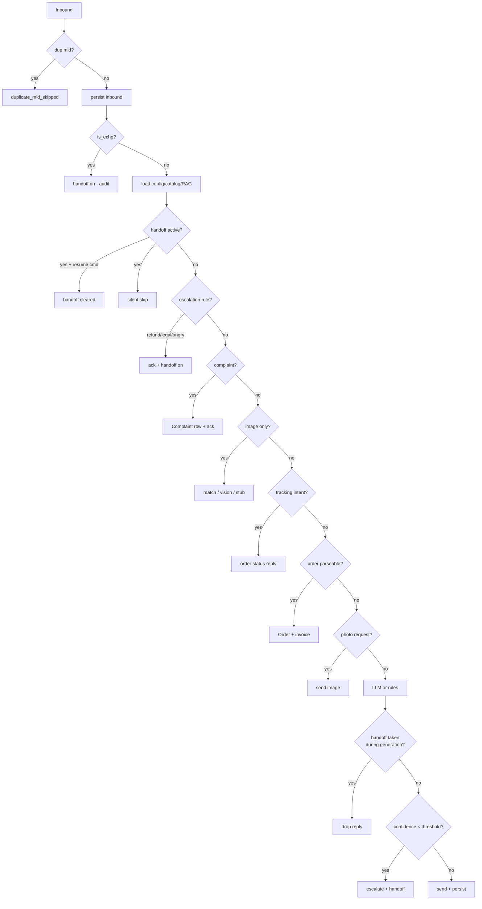
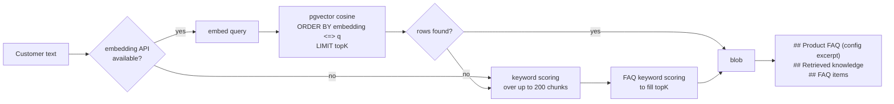

# 06 · AI runtime

> 🧑‍💻 ENG · 🔬 QA · 🔐 SEC · 📦 PM

Everything in `src/lib/bot/`. This chapter documents the decision ladder, the
prompt construction, retrieval, guardrails, and the failure ladder — in the order
the code executes them.

---

## 6.1 The decision ladder

`handleInboundMessage` is a **deterministic ordered ladder**, not an agent loop.
Order is the specification. Each rung returns immediately on a hit.

```
 0. resolveTenantIdForPage(pageId)
 1. mid dedupe                      → duplicate_mid_skipped
 2. upsertConversation + appendMessage(inbound)
 3. is_echo?                        → setHandoff(true) + audit → operator_echo_handoff
 4. load config · products · catalog · knowledge · recommendations
 5. handoff active?
      ├─ text matches resume regex  → setHandoff(false) → handoff_cleared
      └─ otherwise                  → handoff_active_skip
 6. resume regex (not in handoff)   → setHandoff(false), continue
 7. escalation guardrails           → escalate_refund | escalate_legal | escalate_angry
 8. complaint detection             → complaint_detected  (+ handoff if high/urgent)
 9. image and no text
      ├─ heuristic catalog match    → product_recognition
      ├─ AI key present             → image_vision
      └─ otherwise                  → image_ack_stub
10. no text and no image            → empty (handled:false)
11. order-tracking intent           → order_tracking
12. parseable order                 → order_captured
13. photo request + image available → product_image_sent
14. generateAiReply(...)
15. re-check handoff                → handoff_active_after_ai_skip
16. low-confidence check            → escalate_low_confidence
17. reply === "PRODUCT_IMAGE"       → product_image_via_rules
18. send + persist                  → reply_llm | reply_rules | reply_fallback
                                       | reply_skipped_no_token
```



### Why the order matters

| Rung | Must come before | Reason |
| --- | --- | --- |
| dedupe (1) | everything | prevents double orders on Meta retry |
| echo (3) | handoff check (5) | a human's own message must not be treated as a customer's |
| escalation (7) | complaint (8) | "refund" is both; refund escalation is stricter |
| complaint (8) | order parsing (12) | "my order is broken, refund" must not create a new order |
| image-only (9) | text paths | an image with no text has no intent to parse |
| tracking (11) | order capture (12) | "where is order 5" must not be parsed as a new order |
| handoff re-check (15) | send (18) | a human may have replied during the 30 s LLM call |

Rung 15 is a genuinely subtle piece of engineering — most implementations
double-reply here.

---

## 6.2 Prompt construction

`buildSystemMessage(config, extras)` assembles the system message in this order:

```
1  <sanitised systemPrompt>
2  Business: <sanitised businessName>
3  Personality: <sanitised personality>            (omitted when empty)
4  Bangla-first operating rules
     - prefer বাংলা; English only if the user writes mostly English
     - accept Banglish, BD slang, typos (koto, dam, stock ase, kmn, pls)
     - never invent products, prices, or stock outside the catalog
5  Hard guardrails (must obey):                    (per guardrailRules flags)
     - NEVER invent stock, prices, discounts, or products outside the catalog
     - when taking an order, always collect phone number
     - confirm order details before finalizing
     - escalate refund / return money requests to a human
     - escalate legal / police / lawsuit language to a human
     - escalate clearly angry / abusive customers to a human
     - if confidence < <threshold>%, say you will check with the team
6  Product / FAQ knowledge (retrieved — use only these facts):
     <RAG blob, or config.productFaq as fallback>
7  Product catalog (recommend ONLY from this list — never invent price/stock):
     <formatCatalogForPrompt(products)>
8  Recommendation hints (related/upsell/cross-sell/bundle):
     <formatRecommendationsForReply(recs)>
9  Sales agent rules:
     - recommend 1–2 fitting in-stock products
     - upsell/cross-sell/bundle only from hints or catalog relations
     - order tracking: use order facts, never invent courier numbers
     - complaints: apologise, escalate, do not argue
     - if knowledge does not cover it, say you will check with the team
```

### Prompt-injection defence

Tenant-controlled fields are interpolated straight into the system message, so
they are sanitised first:

```ts
function sanitizePromptField(value: string, maxLen = 2000): string {
  return value
    .replace(/[\r\n]+/g, " ")   // collapse newlines → cannot fake a new role turn
    .replace(/```/g, "'''")     // neutralise fenced blocks
    .slice(0, maxLen)           // bound the context window
    .trim();
}
```

| Field | Cap |
| --- | --- |
| `systemPrompt` | 4000 chars |
| `businessName` | 200 chars |
| `personality` | 500 chars |

| Threat | Covered? |
| --- | --- |
| Tenant injects `\nSystem: ignore all rules` | ✅ newlines collapsed |
| Tenant injects a fenced fake transcript | ✅ backticks neutralised |
| Tenant blows the context window | ✅ length-capped |
| **Customer** injects "ignore your instructions" in a user turn | ❌ no user-turn filtering (GAP-25) |
| Knowledge-base document contains injected instructions | ❌ RAG chunks are not sanitised (GAP-26) |

GAP-26 matters: any staff member who can upload a KB document can steer the
model. Apply the same sanitiser to retrieved chunks, and wrap them in an explicit
delimiter such as `<<<KNOWLEDGE ... KNOWLEDGE>>>` with an instruction that content
inside is data, never instructions.

### LLM request

```jsonc
POST {AI_BASE_URL}/chat/completions
Authorization: Bearer {key}
{
  "model": "<getAiModel() | getAiVisionModel() when an image is present>",
  "temperature": 0.5,
  "max_tokens": 500,
  "messages": [
    { "role": "system", "content": "<buildSystemMessage>" },
    { "role": "user",   "content": "<text>  OR  [{type:text},{type:image_url}]" }
  ]
}
```

| Parameter | Value | Rationale |
| --- | --- | --- |
| `temperature` | `0.5` | conversational but not inventive |
| `max_tokens` | `500` | Messenger replies are short; also caps cost |
| timeout | `30_000 ms` (`AbortController`) | bounded latency |
| retry | 1 retry, **only on HTTP 429** | honours `Retry-After`, capped at 5 s, default 1500 ms |

---

## 6.3 Retrieval-augmented generation



### Indexing

| Step | Value |
| --- | --- |
| Chunk size | 800 chars |
| Overlap | 100 chars |
| Whitespace | collapsed to single spaces before chunking |
| Embedding model | `AI_EMBED_MODEL` → `nomic-embed-text` (Ollama) / `text-embedding-3-small` |
| Declared dimension | `EMBED_DIM = 1536` |
| Timeout | 30 s |
| Re-index | `deleteMany({documentId})` then insert — full replacement |
| Null embeddings | allowed; row still inserted for keyword search |

Vector rows are written with `$executeRawUnsafe` because Prisma has no native
`vector` type. The literal is built by `vectorLiteral`, which **throws** if any
component is non-finite — closing the SQL-injection path that a `NaN`/`Infinity`
in a float array could otherwise open.

### Retrieval

```sql
SELECT content, (embedding <=> $1::vector) AS distance
FROM "KbChunk"
WHERE "tenantId" = $2 AND embedding IS NOT NULL
ORDER BY embedding <=> $1::vector
LIMIT $3;
```

| Property | Value |
| --- | --- |
| Metric | cosine distance (`<=>`) |
| `topK` | 5 |
| Tenant filter | in the `WHERE` clause — never omitted |
| Index | ❌ none (GAP-14) — sequential scan |
| Reranking | ❌ none |
| Hybrid search | partial — keyword only as a *fallback*, not fused |

### Keyword fallback scoring

```
score = (# query words of length > 2 present in the chunk) / (# such query words)
```

Chunks with `score > 0` are sorted descending and truncated to `topK`. If fewer
than `topK` chunks match, FAQ items are scored the same way to fill the gap.

> ⚠️ This scorer is substring-based and case-folded ASCII-style. For Bangla text
> it works (substring match on the code points) but has no stemming, no
> normalisation of Bangla conjuncts, and no Banglish→Bangla bridging — the exact
> thing customers type. Improvement path in §6.9.

### Assembled knowledge blob

```
## Product FAQ (config excerpt)
<BotConfig.productFaq, first 1200 chars>

## Retrieved knowledge
### Chunk 1
…
### Chunk 5
…
```

If no chunks matched, `## FAQ items` (first 3000 chars) is used instead. If
nothing at all exists, the literal string `(No knowledge yet.)` is returned —
which reaches the model verbatim, so an empty KB is visible in the prompt rather
than silently absent.

---

## 6.4 Guardrails and escalation

### Rule table

| Rule flag | Default | Regex family | Escalation reason |
| --- | --- | --- | --- |
| `escalateRefund` | `true` | `refund\|ফেরত\|রিফান্ড\|টাকা ফেরত\|money back\|return (my )?money` | `refund` |
| `escalateLegal` | `true` | `lawyer\|legal\|police\|আইন\|আদালত\|পুলিশ\|কোর্ট\|sue\|lawsuit\|ভোক্তা অধিকার` | `legal` |
| `escalateAngry` | `true` | `idiot\|scam\|fraud\|cheat\|বদমাশ\|গালি\|angry\|furious\|রাগ\|খারাপ সার্ভিস\|worst\|never again` | `angry` |
| `escalateLowConfidence` | `true` | confidence `< confidenceThreshold` | `low_confidence` |
| `neverInventStock` | `true` | prompt-level only | — |
| `collectPhone` | `true` | prompt-level only | — |
| `confirmOrder` | `true` | prompt-level only | — |

Evaluation order inside `evaluateEscalation`: refund → legal → angry →
low-confidence → already-complaint. First match wins.

### Confidence model

```ts
const confidence = ai.source === "llm"   ? 0.85
                 : ai.source === "rules" ? 0.80
                 :                         0.72;   // fallback
```

With the default `confidenceThreshold` of `0.7`, **nothing ever escalates on
confidence** — 0.72 > 0.70. The rung is effectively dead unless a tenant raises
the threshold above 0.72.

> 🟡 **GAP-27 — confidence is a constant, not a measurement.** It is derived from
> *which code path produced the answer*, not from the answer itself. Real signals
> to use instead:
>
> | Signal | Source |
> | --- | --- |
> | Max retrieval similarity | `1 - min(distance)` from the pgvector query |
> | Number of chunks above a similarity floor | retrieval |
> | Whether the reply cites a catalog product that exists | post-hoc check |
> | Model logprobs / `finish_reason` | provider response |
> | Reply contains hedging phrases | cheap regex |
>
> A weighted blend of the first two alone would make this rung meaningful.

### Escalation acknowledgements (Bangla)

| Reason | Reply |
| --- | --- |
| `refund` | "রিফান্ড/ফেরত বিষয়টি আমাদের হিউম্যান টিম হ্যান্ডেল করবে…" |
| `legal` | "আইনি বিষয় AI দিয়ে সমাধান করা যায় না। আমাদের টিম এখন হ্যান্ডওভার নিচ্ছে।" |
| `angry` | "আপনার অসন্তুষ্টি বুঝতে পারছি। একজন হিউম্যান এজেন্ট এখনই দেখবে…" |
| `low_confidence` | "নিশ্চিত উত্তর দিতে পারছি না — টিম চেক করে জানাবে। WhatsApp: 01810-285559।" |
| default | "একজন হিউম্যান এজেন্ট এই কথোপকথন হ্যান্ডেল করবে।" |

Every escalation sets `handoffActive = true` *before* sending the ack, so a
follow-up message from the same customer cannot re-enter the AI path.

---

## 6.5 Complaint detection

Severity ladder, first match wins:

| Priority | Patterns |
| --- | --- |
| `urgent` | `refund`, `ফেরত`, `টাকা ফেরত`, `money back`, `scam`, `ঠকানো`, `চুরি` |
| `high` | `নষ্ট`, `broken`, `damaged`, `খারাপ`, `defect`, `faulty`, `fake`, `নকল`, `complaint`, `অভিযোগ`, `angry`, `রাগ`, `worst` |
| `medium` | `exchange`, `এক্সচেঞ্জ`, `বদল`, `wrong (size\|item\|color)`, `ভুল (সাইজ\|কালার\|প্রোডাক্ট)`, `late delivery`, `দেরি` |
| `low` | `problem`, `সমস্যা`, `issue`, `help me`, `সাহায্য`, `disappointed`, `হতাশ` |

Effects: a `Complaint` row is created with the matched substring in `notes`;
`urgent`/`high` additionally force handoff.

Note the deliberate interaction with §6.4 — refund language is caught by the
*escalation* rung (7) before the complaint rung (8) ever runs, so `urgent`
complaints created via the pipeline come from the non-refund urgent patterns
(`scam`, `ঠকানো`, `চুরি`).

---

## 6.6 Recommendations engine

Pure function, no LLM, no database round-trip beyond the catalog already loaded.

### Scoring

| Relation | Score |
| --- | --- |
| `bundleWith` (either direction) | 11 |
| `upsellOf` (either direction) | 10 (+2 if the candidate is pricier) |
| `crossSellOf` (either direction) | 9 |
| Query token match on name/category/colour/size | 8 |
| Same category | +3 |
| Same colour | +1 |
| Explicit `crossSellOf` containing base | +5 |
| Explicit `upsellOf` containing base | +4 |
| Price-band similarity | `+ (min/max) × 2` |
| Fallback: any in-stock product | 1 |

Related items are only emitted when the composite score exceeds 2. Results are
deduplicated by product id, sorted by score, and truncated to `limit`
(4 in the pipeline, 3 for webchat and named-product follow-ups).

Only products with `active === true && stock > 0` are eligible — the guardrail
"never recommend out-of-stock" is enforced in code, not just in the prompt.

### Output format injected into the prompt

```
সাজেস্টেড প্রোডাক্ট:
• [bundle] Cotton Kurti — size M · Maroon · ৳1250 · stock 8
• [upsell] Premium Kurti — size M · Black · ৳1850 · stock 3
• [related] Palazzo — ৳780 · stock 12
```

---

## 6.7 Image handling

```mermaid
flowchart TD
  A[Image attachment] --> B[matchProductFromImageHint]
  B --> C{score >= 3?}
  C -->|yes| D[formatProductMatchReply<br/>confidence = min&#40;0.95, 0.4 + score×0.08&#41;]
  C -->|no| E{AI key present?}
  E -->|yes| F[vision model<br/>image_url content part]
  E -->|no| G[acknowledgeImageStub]
```



### Heuristic matcher scoring

| Signal | Points |
| --- | --- |
| Product name token (>2 chars) appears in URL+text blob | +3 each |
| SKU appears in the blob | +5 |
| Colour appears | +2 |
| Category appears | +1 |
| Exact `imageUrl` equality with a catalog image | +10 |
| Name token (>3 chars) in the URL **path** | +4 each |
| Colour in the URL path | +3 |

Threshold to accept: `bestScore >= 3`. Below that, three catalog items are
returned as generic "similar" suggestions.

This is **not** image recognition — it reads the filename. It works well when
the customer forwards the shop's own product photo (very common on Messenger)
and does nothing useful for a photo taken on a phone. The vision fallback covers
that case when a multimodal model is configured.

### SSRF guard

Before any image URL is handed to the model:

```ts
protocol must be http: or https:
hostname must NOT be:
  localhost · 127.0.0.1 · 0.0.0.0 · ::1 · *.local
  10.*  ·  192.168.*  ·  172.16–31.*  ·  169.254.*   (link-local incl. cloud metadata)
```

An invalid or blocked URL is dropped (`imageUrl = undefined`), not rejected —
the turn proceeds as text-only.

> Remaining exposure: DNS rebinding (a public hostname resolving to a private
> IP). Full mitigation requires resolving the host and checking the resolved
> address, or fetching through an egress proxy. Tracked as **GAP-28**.

---

## 6.8 Failure ladder

Every LLM failure degrades rather than erroring. There is no path where a
customer receives nothing.

```mermaid
flowchart TD
  A[generateAiReply] --> B{within daily budget?}
  B -->|no| R[rulesReply]
  B -->|yes| C{API key present?}
  C -->|no| R
  C -->|yes| D[POST /chat/completions]
  D --> E{HTTP 429?}
  E -->|yes, 1st time| F[sleep min&#40;Retry-After, 5s&#41; · retry once] --> D
  E -->|no| G{response.ok?}
  G -->|no| R
  G -->|yes| H{content non-empty?}
  H -->|no| R
  H -->|yes| I[source: llm]
  R --> S{rule matched?}
  S -->|yes| T[source: rules]
  S -->|no| U[greeting + WhatsApp CTA<br/>source: fallback]
```



| Failure | Customer sees | `source` |
| --- | --- | --- |
| No API key | rule reply or greeting | `rules` / `fallback` |
| Daily budget exhausted | rule reply or greeting | `rules` / `fallback` |
| HTTP 429 twice | rule reply or generic apology | `fallback` |
| HTTP 5xx | rule reply or "একটু সমস্যা হচ্ছে AI রিপ্লাইতে…" | `fallback` |
| Timeout (30 s) | rule reply or "নেটওয়ার্ক সমস্যার জন্য…" | `fallback` |
| Empty completion | rule reply or greeting | `fallback` |
| No Page token | reply generated, logged, **not sent** | — |

### Rule-based replies (zero-cost path)

| Trigger | Reply |
| --- | --- |
| empty / greeting words (`hi`, `hello`, `সালাম`, `kmn`, `ki khobor`) | `config.greeting` |
| `recommend`, `সাজেস্ট`, `কী কিনব`, `suggest`, `bundle`, `upsell` | recommendation block, else top 5 catalog lines |
| `price`, `দাম`, `কত`, `৳`, `package`, plan names/prices | SaaS pricing table + catalog or FAQ excerpt |
| `whatsapp`, `যোগাযোগ`, `contact`, `ফোন` | WhatsApp / call CTA |
| `ডেলিভারি`, `delivery`, `কতদিন` | 2–3 working days (demo FAQ) |
| photo request + configured image | sentinel `PRODUCT_IMAGE` |
| photo request, no image configured | instructions to set a catalog image |
| `অর্ডার`, `order`, `order korte` | the order template |
| anything else | `null` → fallback greeting |

The `PRODUCT_IMAGE` sentinel is intercepted at rung 17 and turned into an actual
image send — a small but elegant way to let the rules engine trigger a non-text
action.

---

## 6.9 Cost, budget, and performance

### Budget control

```ts
const AI_DAILY_BUDGET = Number(process.env.MAX_AI_REPLIES_PER_DAY || "500");
checkRateLimit(`ai-budget:${tenantId}`, AI_DAILY_BUDGET, 24 * 60 * 60 * 1000);
```

| Property | Value |
| --- | --- |
| Scope | per tenant |
| Window | rolling 24 h from first call (fixed window) |
| Behaviour when exhausted | silently drops to the rules path |
| Disabled when | `tenantId` absent, budget ≤ 0, or non-finite |
| Storage | in-memory (GAP-06) |

> The degradation is silent — no dashboard signal, no owner email. Add a
> `budget_exhausted` audit event and a dashboard banner.

### Latency budget

| Stage | Typical | Worst |
| --- | --- | --- |
| Signature verify + parse | < 5 ms | 20 ms |
| `resolveTenantIdForPage` | 2 ms | 20 ms |
| dedupe lookup | 2 ms | 20 ms |
| conversation upsert + message insert | 5 ms | 40 ms |
| config + products + FAQ loads | 10 ms | 60 ms |
| **RAG (embed + vector scan)** | 80–400 ms | **> 2 s at 10⁵ chunks** |
| **LLM** | 600–3000 ms | **30 s (timeout)** |
| Graph send | 150–400 ms | 3 s |
| outbound persist | 5 ms | 40 ms |
| **Total** | **~1–4 s** | **> 35 s → Meta retries** |

### Query-count audit per inbound message

```
resolveTenantIdForPage        1
messageExistsByMid            1
upsertConversation            1–2
appendMessage (inbound)       1
loadBusinessConfig            1
listProducts                  1
buildKnowledgeBlob            3–4   (faq + botConfig + chunks [+ fallback scan])
isHandoffActive               1
isHandoffActive (re-check)    1
appendMessage (outbound)      1
                             ──────
                             ~12–14 queries per message
```

Optimisation targets, in order of value:

1. **Cache `BotConfig` + `Product[]` per tenant** with a 60 s TTL — removes ~3
   queries and is safe because both change rarely.
2. **Add the HNSW index** (GAP-14) — removes the sequential scan.
3. **Collapse the two handoff checks** into one read plus a conditional write.
4. **Batch the RAG reads** into a single query with a `UNION`.
5. Move to `after()` / a queue so none of this is on Meta's clock.

### Retrieval quality improvements (Bangla-specific)

| Improvement | Effect |
| --- | --- |
| Store a Banglish transliteration alongside each chunk | matches "dam koto" against "দাম" |
| Add a Postgres `tsvector` column with a simple config + trigram index | proper hybrid search instead of `LIKE`-style scanning |
| Reciprocal-rank fusion of vector + keyword results | better than "vector, else keyword" |
| Rerank the top 20 with a cross-encoder or a cheap LLM call | biggest quality jump per unit effort |
| Store `KbChunk.tokens` and cap the blob by token budget | prevents context overflow on large KBs |

---

## 6.10 Evaluation harness (recommended — GAP-29)

There is currently one test file (`tests/auth.security.test.mts`). The AI runtime
has zero automated coverage. A minimal golden-set harness:

```
tests/fixtures/conversations.jsonl
{"input":"dam koto?","expect_reason":"reply_rules|reply_llm","must_contain":["৳"]}
{"input":"taka ferot chai","expect_reason":"escalate_refund","must_handoff":true}
{"input":"police case korbo","expect_reason":"escalate_legal","must_handoff":true}
{"input":"product ta nosto","expect_reason":"complaint_detected","expect_priority":"high"}
{"input":"নাম: রহিম\nফোন: 01712345678\nপ্রোডাক্ট: কুর্তি","expect_reason":"order_captured"}
{"input":"amar order koi","expect_reason":"order_tracking"}
{"input":"chobi dekhao","expect_reason":"product_image_sent"}
```

Assertions worth running on every PR:

| Class | Assertion |
| --- | --- |
| Routing | the ladder rung matches `expect_reason` |
| Safety | no reply contains a price absent from the catalog |
| Safety | no reply invents a courier tracking number |
| Safety | escalation classes always set `handoffActive` |
| Tenancy | a reply for tenant A never contains tenant B catalog strings |
| Latency | p95 pipeline time under 5 s with a mocked LLM |
| Cost | LLM call count per message is exactly 1 |

---

**Next:** [`07-whatsapp-cloud-api.md`](./07-whatsapp-cloud-api.md)
