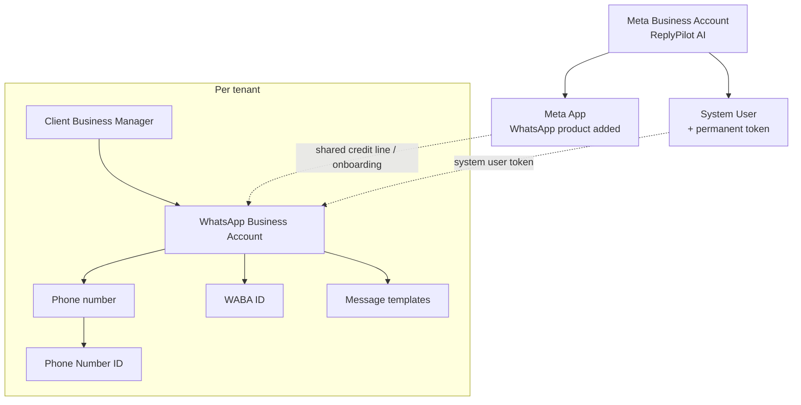
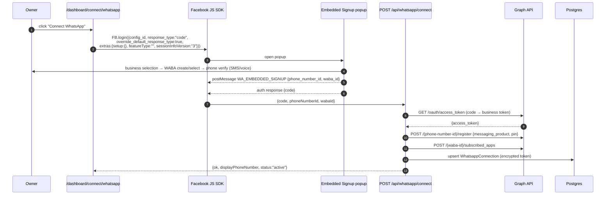
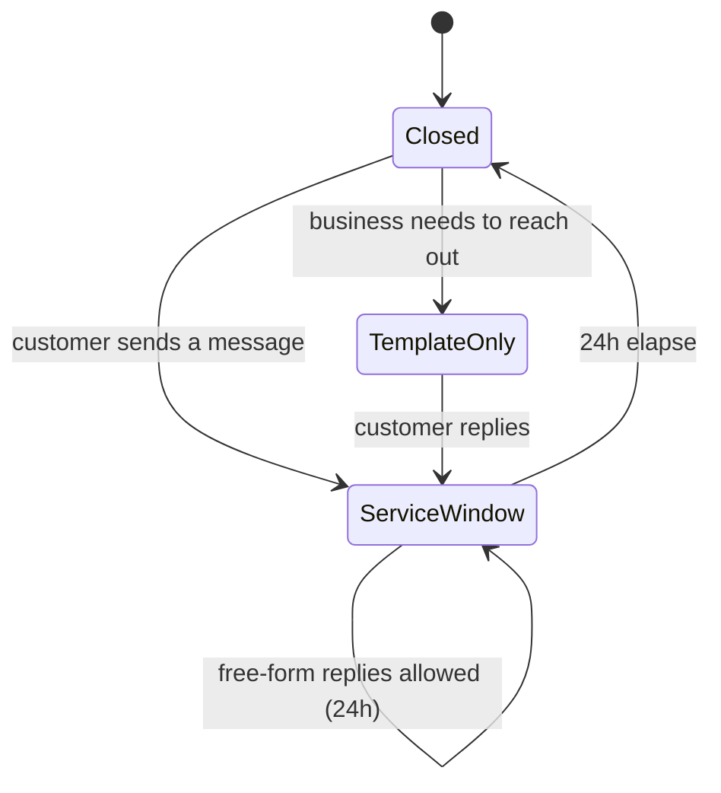

# 07 · WhatsApp Cloud API

> 📦 PM · 🧑‍💻 ENG · 🎨 DES
>
> # 🔴 SPEC — NOT IMPLEMENTED
>
> There is **no WhatsApp code in this repository.** `NEXT_PUBLIC_WHATSAPP_NUMBER`
> exists only to render `wa.me` deep links on the landing page and in bot
> replies. This chapter is the implementation specification, written so it can be
> built without further discovery. Every code block here is *proposed*, not
> shipped.

---

## 7.1 Why WhatsApp matters for this market

| Fact | Consequence |
| --- | --- |
| WhatsApp is the dominant 1:1 channel in Bangladesh | Messenger-only coverage misses half the conversations |
| The bot already tells customers "WhatsApp 01810-285559" | Every escalation currently *leaves* the product |
| Cloud API has no per-message fee for service conversations initiated by the user within 24 h | Marginal cost stays near zero for support |
| Template messages enable proactive order updates | Unlocks the delivery-notification use case Messenger blocks |

Strategic framing: Messenger wins the *sale*; WhatsApp wins the *relationship
after the sale*. Order confirmations, courier updates, and delivery notifications
are template-message use cases with clear utility categories.

---

## 7.2 Account topology



| Identifier | What it is | Where it is used | Where it is stored (proposed) |
| --- | --- | --- | --- |
| **WABA ID** | WhatsApp Business Account id | template management, webhook subscription | `WhatsappConnection.wabaId` |
| **Phone Number ID** | the sending identity | every send call: `POST /{phone-number-id}/messages` | `WhatsappConnection.phoneNumberId` |
| **Display phone number** | `+8801810285559` | UI only | `WhatsappConnection.displayPhoneNumber` |
| **Business ID** | client's Business Manager | asset sharing | `WhatsappConnection.businessId` |
| **Access token** | system-user or business token | Authorization header | encrypted column |
| **App Secret** | shared with Messenger | `X-Hub-Signature-256` | `META_APP_SECRET` |
| **Verify token** | webhook handshake | `hub.verify_token` | `WHATSAPP_VERIFY_TOKEN` |

---

## 7.3 Embedded signup flow

Embedded Signup lets a business owner create or attach a WABA, verify a phone
number, and grant ReplyPilot AI access — all inside a Facebook-hosted popup.



### Front-end integration sketch

```tsx
// src/components/dashboard/WhatsappConnectButton.tsx  (proposed)
useEffect(() => {
  const onMessage = (event: MessageEvent) => {
    if (event.origin !== "https://www.facebook.com") return;
    try {
      const data = JSON.parse(event.data);
      if (data.type !== "WA_EMBEDDED_SIGNUP") return;
      if (data.event === "FINISH") {
        setSignupInfo(data.data);              // {phone_number_id, waba_id}
      } else if (data.event === "CANCEL") {
        setError(`Cancelled at step: ${data.data.current_step}`);
      } else if (data.event === "ERROR") {
        setError(data.data.error_message);
      }
    } catch { /* non-JSON postMessage from other Meta widgets */ }
  };
  window.addEventListener("message", onMessage);
  return () => window.removeEventListener("message", onMessage);
}, []);

const launch = () =>
  FB.login(
    (res) => {
      if (res.authResponse?.code) exchange(res.authResponse.code, signupInfo);
    },
    {
      config_id: process.env.NEXT_PUBLIC_META_WA_CONFIG_ID,
      response_type: "code",
      override_default_response_type: true,
      extras: { setup: {}, featureType: "", sessionInfoVersion: "3" },
    },
  );
```

### Required permissions

| Permission | Purpose |
| --- | --- |
| `whatsapp_business_management` | Manage WABA, templates, phone numbers |
| `whatsapp_business_messaging` | Send and receive messages |
| `business_management` | Access the client's Business Manager assets |

All three require App Review with Advanced Access, plus completed Business
Verification for the ReplyPilot AI Business Account.

### Phone-number registration

```http
POST https://graph.facebook.com/v21.0/{phone-number-id}/register
Authorization: Bearer {token}
{ "messaging_product": "whatsapp", "pin": "000000" }
```

The PIN is the two-step verification code. Store it encrypted — re-registration
after a migration requires it. If two-step was never enabled, set it explicitly:

```http
POST /v21.0/{phone-number-id}
{ "pin": "<6 digits>" }
```

---

## 7.4 Proposed data model

```prisma
model WhatsappConnection {
  id                  String    @id
  tenantId            String
  wabaId              String
  phoneNumberId       String
  displayPhoneNumber  String
  businessId          String?
  verifiedName        String?
  qualityRating       String?   // GREEN | YELLOW | RED
  messagingLimitTier  String?   // TIER_50 | TIER_250 | TIER_1K | TIER_10K | TIER_100K | UNLIMITED
  status              String    // active | pending | error | disconnected
  tokenCiphertext     Bytes?
  tokenIv             Bytes?
  tokenTag            Bytes?
  pinCiphertext       Bytes?
  lastError           String?
  lastSyncAt          DateTime?
  createdAt           DateTime  @default(now())
  updatedAt           DateTime  @updatedAt

  tenant    Tenant             @relation(fields: [tenantId], references: [id], onDelete: Cascade)
  templates WhatsappTemplate[]

  @@unique([tenantId, phoneNumberId])
  @@index([phoneNumberId])          // inbound routing
  @@index([wabaId])
}

model WhatsappTemplate {
  id            String   @id
  tenantId      String
  connectionId  String
  name          String
  language      String   // "bn" | "en_US"
  category      String   // UTILITY | MARKETING | AUTHENTICATION
  status        String   // APPROVED | PENDING | REJECTED | PAUSED | DISABLED
  bodyText      String
  variableCount Int      @default(0)
  rejectedReason String?
  metaTemplateId String?
  updatedAt     DateTime @updatedAt

  connection WhatsappConnection @relation(fields: [connectionId], references: [id], onDelete: Cascade)

  @@unique([tenantId, name, language])
}

model WhatsappMessageStatus {
  id          String   @id
  tenantId    String
  messageId   String   // wamid
  conversationId String?
  status      String   // sent | delivered | read | failed
  errorCode   Int?
  errorTitle  String?
  pricingCategory String?   // utility | marketing | service | authentication
  billable    Boolean  @default(false)
  timestamp   DateTime

  @@unique([messageId, status])
  @@index([tenantId, timestamp])
}
```

`Conversation.channel` gains a third value: `"whatsapp"`. Because the unique key
is already `(tenantId, pageId, senderId, channel)`, WhatsApp threads slot in with
`pageId = phoneNumberId` and `senderId = customer wa_id` — **no schema change to
`Conversation` is required.**

---

## 7.5 Webhook

Single endpoint, shared verify pattern with Messenger.

### `GET /api/whatsapp/webhook`

Identical handshake to `/api/messenger/webhook`, comparing against
`WHATSAPP_VERIFY_TOKEN`.

### `POST /api/whatsapp/webhook`

Signature verification is the same HMAC-SHA256 over the raw body with
`META_APP_SECRET` — reuse `verifyMetaSignature` unchanged.

Inbound text payload:

```jsonc
{
  "object": "whatsapp_business_account",
  "entry": [{
    "id": "<WABA_ID>",
    "changes": [{
      "field": "messages",
      "value": {
        "messaging_product": "whatsapp",
        "metadata": { "display_phone_number": "8801810285559",
                      "phone_number_id": "<PHONE_NUMBER_ID>" },
        "contacts": [{ "profile": { "name": "Rahim" }, "wa_id": "8801712345678" }],
        "messages": [{
          "from": "8801712345678",
          "id": "wamid.HBgN...",
          "timestamp": "1735689600",
          "type": "text",
          "text": { "body": "কুর্তি দাম কত?" }
        }]
      }
    }]
  }]
}
```

Status payload:

```jsonc
{
  "statuses": [{
    "id": "wamid.HBgN...",
    "status": "delivered",          // sent | delivered | read | failed
    "timestamp": "1735689612",
    "recipient_id": "8801712345678",
    "conversation": { "id": "…", "origin": { "type": "service" } },
    "pricing": { "billable": true, "pricing_model": "CBP", "category": "service" },
    "errors": [{ "code": 131047, "title": "Re-engagement message" }]
  }]
}
```

### Normaliser (proposed)

```ts
// src/lib/bot/whatsapp.ts
export function normalizeWhatsappEvents(body: unknown): InboundMessage[] {
  const payload = body as WhatsappWebhookBody;
  if (payload?.object !== "whatsapp_business_account") return [];
  const out: InboundMessage[] = [];

  for (const entry of payload.entry ?? []) {
    for (const change of entry.changes ?? []) {
      if (change.field !== "messages") continue;
      const phoneNumberId = change.value.metadata?.phone_number_id;
      for (const m of change.value.messages ?? []) {
        out.push({
          senderId: m.from,
          pageId: phoneNumberId,            // routes via the same tenant resolver
          mid: m.id,                        // wamid — same dedupe path
          text:
            m.text?.body ??
            m.button?.text ??
            m.interactive?.button_reply?.title ??
            m.interactive?.list_reply?.title,
          imageUrl: m.image?.id ? mediaUrlFor(m.image.id) : undefined,
          timestamp: Number(m.timestamp) * 1000,
        });
      }
    }
  }
  return out;
}
```

Because the envelope reduces to the existing `InboundMessage` shape, **the whole
decision ladder in `bot/pipeline.ts` is reused with zero changes** — this is the
payoff of the thin-adapter principle from chapter 02.

---

## 7.6 Sending

### Free-form text (only inside the 24-hour service window)

```http
POST https://graph.facebook.com/v21.0/{phone-number-id}/messages
Authorization: Bearer {token}
{
  "messaging_product": "whatsapp",
  "recipient_type": "individual",
  "to": "8801712345678",
  "type": "text",
  "text": { "preview_url": false, "body": "কুর্তির দাম ৳1,250।" }
}
```

### Template message (required outside the window)

```http
POST /v21.0/{phone-number-id}/messages
{
  "messaging_product": "whatsapp",
  "to": "8801712345678",
  "type": "template",
  "template": {
    "name": "order_shipped_bn",
    "language": { "code": "bn" },
    "components": [{
      "type": "body",
      "parameters": [
        { "type": "text", "text": "INV-2026-0041" },
        { "type": "text", "text": "Sundarban Courier" },
        { "type": "text", "text": "SC998877" }
      ]
    }]
  }
}
```

### Media

```jsonc
{ "type": "image", "image": { "link": "https://cdn/…/kurti.jpg",
                              "caption": "Cotton Kurti — ৳1,250" } }
{ "type": "document", "document": { "link": "https://…/invoice.pdf",
                                    "filename": "INV-2026-0041.pdf" } }
```

Inbound media must be fetched in two steps and requires the access token:

```
GET /v21.0/{media-id}                  → { url, mime_type, sha256, file_size }
GET <url>  with  Authorization: Bearer  → binary
```

That URL is short-lived (~5 minutes) and **cannot** be handed to a vision model
directly — it must be downloaded and re-hosted. This is a real difference from
Messenger, where attachment URLs are publicly fetchable.

### Typing indicator and read receipts

```jsonc
// mark read (also shows the blue ticks to the customer)
POST /{phone-number-id}/messages
{ "messaging_product": "whatsapp", "status": "read", "message_id": "wamid.…" }

// typing indicator (send together with the read receipt)
{ "messaging_product": "whatsapp", "status": "read",
  "message_id": "wamid.…", "typing_indicator": { "type": "text" } }
```

The typing indicator lasts up to 25 seconds or until a message is sent — which
maps almost exactly onto the LLM latency budget in §6.9. Send it immediately
after signature verification, before the pipeline runs.

---

## 7.7 Conversation pricing and windows



| Category | When | Billed |
| --- | --- | --- |
| **Service** | customer-initiated, within 24 h | free (per current Meta pricing for service conversations) |
| **Utility** | order/delivery updates via template | per-message |
| **Marketing** | promotional template | per-message, higher rate |
| **Authentication** | OTP template | per-message |

Design implication for ReplyPilot AI: keep every AI reply inside the service
window, and reserve templates for the three order-lifecycle events. Never send a
marketing template without explicit opt-in — it damages quality rating for every
tenant sharing the number.

### Quality rating and messaging tiers

| Quality | Meaning | Action |
| --- | --- | --- |
| 🟢 GREEN | High | normal |
| 🟡 YELLOW | Medium | reduce template volume, review copy |
| 🔴 RED | Low | pause marketing templates immediately; tier drop is imminent |

| Tier | Unique customers per 24 h |
| --- | --- |
| `TIER_50` | 50 |
| `TIER_250` | 250 |
| `TIER_1K` / `TIER_10K` / `TIER_100K` | 1,000 / 10,000 / 100,000 |
| `UNLIMITED` | unlimited |

Subscribe to the `account_update` and `message_template_status_update` webhook
fields to keep `qualityRating` and template `status` current in the database, and
surface both in the dashboard — an owner should never discover a RED rating from
Meta's email.

---

## 7.8 Template catalogue (proposed, Bangla-first)

| Name | Category | Body |
| --- | --- | --- |
| `order_confirmed_bn` | UTILITY | `আপনার অর্ডার কনফার্ম হয়েছে ✓\nইনভয়েস: {{1}}\nপ্রোডাক্ট: {{2}}\nমোট: ৳{{3}}\nশীঘ্রই পাঠানো হবে।` |
| `order_shipped_bn` | UTILITY | `আপনার অর্ডার {{1}} কুরিয়ারে দেওয়া হয়েছে।\nকুরিয়ার: {{2}}\nট্র্যাকিং: {{3}}` |
| `order_delivered_bn` | UTILITY | `অর্ডার {{1}} ডেলিভারি সম্পন্ন ✓ ধন্যবাদ! কোনো সমস্যা হলে এই চ্যাটে লিখুন।` |
| `abandoned_cart_bn` | MARKETING | `{{1}} এখনো স্টকে আছে — ৳{{2}}। অর্ডার করতে চাইলে জানান।` |
| `complaint_ack_bn` | UTILITY | `আপনার অভিযোগ #{{1}} রেকর্ড হয়েছে। আমাদের টিম {{2}} ঘণ্টার মধ্যে যোগাযোগ করবে।` |

Template review notes that reliably cause rejection: variables at the very start
or end of the body, consecutive variables, promotional language in a UTILITY
template, and URLs that do not match the business domain.

---

## 7.9 Error catalogue

| Code | Meaning | Handling |
| --- | --- | --- |
| 131047 | Re-engagement required (24 h window closed) | switch to a template |
| 131026 | Message undeliverable (not a WhatsApp user) | mark thread undeliverable |
| 131051 | Unsupported message type | fall back to text |
| 131053 | Media upload error | re-host and retry once |
| 132000 | Template param count mismatch | fix the mapping; never retry blindly |
| 132001 | Template does not exist / not approved | fall back to service reply or queue |
| 132005 | Template text was edited | resync template from Graph |
| 132007 | Template format policy violation | resubmit |
| 133010 | Phone number not registered | re-run `/register` with the PIN |
| 133016 | Rate limit hit | exponential backoff |
| 368 | Temporarily blocked for policy violation | pause all sends, alert operator |
| 80007 | Rate limit (business account) | backoff |
| 190 | Token invalid/expired | reconnect flow |

---

## 7.10 Implementation plan

| Phase | Deliverable | Estimate |
| --- | --- | --- |
| **W1** | `WhatsappConnection` model + migration + encrypted token helper | 2 d |
| **W2** | `GET/POST /api/whatsapp/webhook` + `normalizeWhatsappEvents` + reuse of the pipeline | 3 d |
| **W3** | Outbound adapter (text, image, document, read receipt, typing) | 2 d |
| **W4** | Embedded Signup UI + `POST /api/whatsapp/connect` + `/register` + `subscribed_apps` | 4 d |
| **W5** | Template model, sync job, dashboard template manager | 4 d |
| **W6** | Status webhook → `WhatsappMessageStatus` → delivery analytics | 2 d |
| **W7** | Order-lifecycle template triggers (confirmed / shipped / delivered) | 3 d |
| **W8** | Quality-rating + tier monitoring, alerts | 2 d |
| **W9** | App Review submission: screencast, use-case docs, privacy policy links | 5 d wall-clock |

**Critical path:** Business Verification → App Review. Start it in W1; it gates
W4 onwards and is measured in weeks, not days.

### Environment variables to add

```bash
WHATSAPP_VERIFY_TOKEN=<long random string>
NEXT_PUBLIC_META_WA_CONFIG_ID=<embedded signup configuration id>
META_SYSTEM_USER_TOKEN=<permanent system user token>
TOKEN_ENCRYPTION_KEY=<32-byte base64 key, shared with the Page-token fix>
WHATSAPP_DEFAULT_TEMPLATE_LANG=bn
```

---

**Next:** [`08-design-system.md`](./08-design-system.md)
