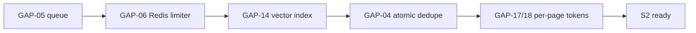

# 10 · Operations runbook

> 🧑‍💻 ENG · 🔬 QA

---

## 10.1 Error handling philosophy

The codebase follows three rules consistently. Preserve them.

| Rule | Example |
| --- | --- |
| **Never leave the customer with silence** | Every LLM failure falls back to rules, then to a greeting + WhatsApp CTA |
| **Errors carry remediation, not just a code** | The webhook `503` names the env var, the file to edit, and the Meta screen to visit |
| **Fail closed on identity, fail open on features** | An unsigned session is rejected; a missing AI key degrades to rules |

### Error taxonomy

| Class | HTTP | Retryable | Customer-visible | Example |
| --- | --- | --- | --- | --- |
| Validation | 400 | no | yes | `text required.` |
| Authentication | 401 | no | yes | `Invalid credentials.` |
| Authorization | 403 | no | yes | `Only Admin/Manager can add team members.` |
| Not found | 404 | no | yes | `Order not found.` |
| Rate limit | 429 | **yes**, after `Retry-After` | yes | `Too many requests.` |
| Upstream (LLM/Graph) | — | yes | **no** — degraded reply instead | `[ai] API error 503` |
| Internal | 500 | maybe | generic | `Reply generation failed.` |
| Dependency down | 503 | yes | yes | `/api/health` unhealthy |

---

## 10.2 Retry logic — complete inventory

| Operation | Retries | Backoff | Notes |
| --- | --- | --- | --- |
| LLM chat completion | **1**, on HTTP 429 only | `min(Retry-After × 1000, 5000)`, default 1500 ms | `attempt < 1` guard |
| LLM timeout (30 s) | 0 | — | falls straight to rules |
| LLM 5xx | 0 | — | falls straight to rules |
| Embedding call | 0 | — | returns `null` → keyword fallback |
| Graph send (text/image) | **0** | — | ⚠️ GAP-42 — a transient 500 loses the reply permanently |
| Leads/Orders sheet webhook | 0 | — | ⚠️ GAP-16 — silent loss |
| Meta → us (inbound) | Meta's own | Meta's own | mitigated by `mid` dedupe |
| Prisma queries | 0 | — | connection-level retry only |

### Recommended universal retry helper

```ts
export async function retry<T>(
  fn: () => Promise<T>,
  { attempts = 3, base = 300, cap = 5000, retryable = () => true } = {},
): Promise<T> {
  let lastError: unknown;
  for (let i = 0; i < attempts; i++) {
    try { return await fn(); }
    catch (error) {
      lastError = error;
      if (!retryable(error) || i === attempts - 1) break;
      const delay = Math.min(cap, base * 2 ** i) + Math.random() * 200;  // full jitter
      await new Promise((r) => setTimeout(r, delay));
    }
  }
  throw lastError;
}
```

Apply to Graph sends with `retryable = (e) => e.status >= 500 || e.code === 613`
and **never** to token errors (190) or window errors (10) — those are permanent
and retrying makes the quality rating worse.

---

## 10.3 Rate limits — operational view

| Limiter | Key | Limit | Window | Failure mode when hit |
| --- | --- | --- | --- | --- |
| Login | `login:<ip>` | 10 | 15 min | `429` + `Retry-After` |
| Leads | `leads:<ip>` | 20 | 60 min | `429` |
| Orders | `orders:<ip>` | 20 | 60 min | `429` |
| Bot reply | `bot-reply:<ip>` | 20 | 10 min | `429` |
| Webchat | `webchat:<ip>` | 30 | 5 min | `429` |
| Comments | `comments:<ip>` | 30 | 60 min | `429` |
| **AI budget** | `ai-budget:<tenantId>` | 500/day | 24 h | **silent** degradation to rules |

Implementation notes an operator must know:

- Fixed window, not sliding — 30 requests at 11:59 and 30 more at 12:01 both pass.
- The map is cleaned every 5 minutes; between cleanups it holds every key seen.
- **A deploy resets every counter.** Frequent deploys effectively disable limits.
- Behind N instances the real limit is N × the configured value.

### Redis replacement (drop-in)

```ts
// same signature, sliding window
export async function checkRateLimit(key: string, limit: number, windowMs: number) {
  const now = Date.now();
  const k = `rl:${key}`;
  const tx = redis.multi();
  tx.zremrangebyscore(k, 0, now - windowMs);
  tx.zadd(k, now, `${now}-${Math.random()}`);
  tx.zcard(k);
  tx.pexpire(k, windowMs);
  const [, , count] = await tx.exec();
  if ((count as number) > limit) {
    return { allowed: false, retryAfterSec: Math.ceil(windowMs / 1000) };
  }
  return { allowed: true };
}
```

---

## 10.4 Troubleshooting decision tree

### "The bot isn't replying on Messenger"

```
START
 │
 ├─▶ Does GET /api/health return 200?
 │     NO  → database is down. Check DATABASE_URL, connection pool, provider status.
 │     YES ↓
 │
 ├─▶ Does the Meta webhook show recent deliveries in the App dashboard?
 │     NO  → the webhook is not subscribed.
 │           • Verify Callback URL = https://<domain>/api/messenger/webhook
 │           • Verify Token matches META_VERIFY_TOKEN exactly
 │           • POST /{page-id}/subscribed_apps was never called → GAP-01
 │     YES ↓
 │
 ├─▶ Do the server logs show "[webhook]" entries?
 │     NO  → traffic is not arriving. Check DNS, TLS, and any proxy in front.
 │     YES ↓
 │
 ├─▶ Is the response 401 "Invalid signature."?
 │     YES → META_APP_SECRET is wrong or missing. Copy it again from
 │           Meta → App → Settings → Basic → App Secret.
 │     NO  ↓
 │
 ├─▶ What is results[0].reason?
 │     duplicate_mid_skipped        → Meta is retrying; the first attempt was slow.
 │                                    Check LLM latency. This is a symptom of GAP-05.
 │     handoff_active_skip          → a human owns the thread. Customer types
 │                                    "bot on" or an agent clicks Leave in the Inbox.
 │     operator_echo_handoff        → someone replied from the Page inbox.
 │     escalate_*                   → working as designed; check the Inbox.
 │     complaint_detected           → working as designed; check Complaints.
 │     reply_skipped_no_token       → META_PAGE_ACCESS_TOKEN missing or expired.
 │     empty                        → unsupported attachment type (video/audio/file).
 │     error                        → read the "[webhook] handle error:" stack.
 │     reply_llm / reply_rules      → we DID reply; the failure is downstream ↓
 │
 └─▶ Reply generated but not delivered?
       • Check for "[messenger] send text failed" with a Graph error code.
       • 190 → token invalid/expired → reconnect the Page (§05.11).
       • 10/2018278 → outside the 24-hour window → needs a message tag (GAP-21).
       • 613 → rate limited by Meta → back off.
       • 200 → permission missing → re-request pages_messaging.
```

### "Replies are generic / not using my catalog"

```
 ├─▶ POST /api/bot/reply — what is "source"?
 │     "fallback" → no AI key, or the daily budget is exhausted, or the provider
 │                  is unreachable. Check "[ai]" log lines.
 │     "rules"    → no AI key configured (AI_PROVIDER / AI_BASE_URL / key).
 │                  For Ollama, confirm the server is up: curl $AI_BASE_URL/models
 │     "llm"      → the model answered; the problem is prompt/knowledge ↓
 │
 ├─▶ Are products Active with stock > 0?
 │     listProducts(tenantId, true) filters on active; recommendations also
 │     require stock > 0.
 │
 ├─▶ Is knowledge retrieved?
 │     If buildKnowledgeBlob returns "(No knowledge yet.)" the KB is empty for
 │     this tenant. Upload documents or add FAQ items.
 │
 ├─▶ Are embeddings present?
 │     SELECT count(*) FROM "KbChunk" WHERE embedding IS NULL AND "tenantId"=…;
 │     A high count means embedding calls failed at index time — the KB is in
 │     keyword-only mode. Re-index after fixing AI_EMBED_MODEL / the provider.
 │
 └─▶ Is the right tenant being used?
       Look for "[tenant-scope] rejected cross-tenant request" in the logs.
       For webhooks, confirm a PageConnection row exists with status='active'
       for that pageId — otherwise everything runs as the DEFAULT tenant.
```

### "Dashboard login fails"

```
 ├─ 429 → 10 attempts in 15 minutes from this IP. Wait or restart the process.
 ├─ 401 → • wrong password
 │        • the tenant is disabled (checked before the password) — enable it in
 │          /admin/tenants
 │        • the passwordHash does not start with "$2" → the row is corrupt;
 │          re-seed or reset it
 ├─ 500 with "SESSION_SECRET must be at least 32 characters in production"
 │        → set a longer secret and redeploy
 └─ Login succeeds but the next request is 401
          → the cookie is not being stored. Check that the site is HTTPS in
            production (secure flag) and that the domain matches.
```

### "Knowledge upload succeeds but answers don't change"

```
 ├─ Was the document chunked?  SELECT count(*) FROM "KbChunk" WHERE "documentId"=…
 ├─ Did embedding succeed?     look for "[rag] embed API <status>" warnings
 ├─ Does retrieval find it?    the query must share >2-char tokens with the chunk
 │                             when in keyword mode
 └─ Is the blob being truncated? productFaq is capped at 1200 chars and the FAQ
                                fallback at 3000
```

---

## 10.5 Log reference

| Prefix | Emitted when | Severity |
| --- | --- | --- |
| `[startup] Missing required environment variable(s):` | boot with missing env | fatal in prod |
| `[startup] SUPER_ADMIN_EMAIL is not set` | boot | warn |
| `[auth] SESSION_SECRET not set — using an insecure dev-only default.` | boot in dev | warn |
| `[webhook] handle error:` | pipeline threw | error |
| `[messenger] No META_PAGE_ACCESS_TOKEN — reply not sent.` | send attempted | warn |
| `[messenger] send text/image failed <status> <body>` | Graph rejected | error |
| `[ai] API error <status> <body>` | LLM non-2xx | error |
| `[ai] request timed out` | 30 s abort | error |
| `[ai] fetch error:` | network failure | error |
| `[rag] embed API <status>` | embedding non-2xx | warn |
| `[rag] embed error` | embedding threw | warn |
| `[rag] vector search failed, keyword fallback` | pgvector query failed | warn |
| `[rag] skipping invalid embedding` | non-finite vector | warn |
| `[tenant-scope] rejected cross-tenant request for "<id>"` | public API tenant spoof | warn |
| `[pipeline] Would reply: <text>` | reply generated, no token | info |
| `[api/health] DB check failed:` | health probe failed | error |

### Alerting rules to configure

| Alert | Condition | Severity |
| --- | --- | --- |
| Health down | `/api/health` non-200 twice in a row | P1 |
| Webhook silence | zero `[webhook]` lines for 30 min during business hours | P1 |
| Send failures | > 5 `[messenger] send * failed` in 5 min | P1 |
| Token invalid | any Graph error code 190 | P1 |
| AI degraded | > 20% of replies with `source = fallback` over 15 min | P2 |
| Budget exhausted | any `ai-budget` rejection | P2 |
| Cross-tenant probe | any `[tenant-scope] rejected` line | P2 (security) |
| Vector fallback | any `[rag] vector search failed` | P3 |
| Slow pipeline | p95 webhook handling > 10 s | P2 |

---

## 10.6 Performance tuning

### Quick wins, ranked by value ÷ effort

| # | Change | Effect | Effort |
| --- | --- | --- | --- |
| 1 | Process the webhook with `after()` instead of inline | removes the Meta timeout class of bugs | 1 h |
| 2 | Add the HNSW index on `KbChunk.embedding` | vector search from O(n) to O(log n) | 1 h |
| 3 | Cache `BotConfig` + `Product[]` per tenant, 60 s TTL | −3 queries per message | 3 h |
| 4 | Collapse the double handoff check into one read | −1 query per message | 1 h |
| 5 | Add a unique partial index on `(tenantId, mid)` | atomic dedupe, kills double replies | 2 h |
| 6 | Batch the RAG reads (`faq` + `botConfig` + `chunks`) | −2 round trips | 2 h |
| 7 | Reduce `max_tokens` for short intents | lower latency and cost | 2 h |
| 8 | Stream the LLM response for the web widget | perceived latency halves | 1 d |
| 9 | Move the rate limiter to Redis | correctness under scale | 1 d |
| 10 | Introduce a queue for reply generation | true horizontal scale | 3 d |

### Caching design (item 3)

```ts
type Entry<T> = { value: T; expires: number };
const cache = new Map<string, Entry<unknown>>();

export async function cached<T>(key: string, ttlMs: number, load: () => Promise<T>) {
  const hit = cache.get(key) as Entry<T> | undefined;
  if (hit && hit.expires > Date.now()) return hit.value;
  const value = await load();
  cache.set(key, { value, expires: Date.now() + ttlMs });
  return value;
}

// invalidate on write
export const invalidateTenant = (tenantId: string) => {
  for (const k of cache.keys()) if (k.startsWith(`${tenantId}:`)) cache.delete(k);
};
```

Call `invalidateTenant` from `saveBotConfig` and every product mutation. In a
multi-instance world this becomes stale for up to 60 s on other instances —
acceptable for config, and the TTL is the bound.

### Database tuning

```sql
-- find the slow queries
SELECT query, calls, mean_exec_time, total_exec_time
FROM pg_stat_statements ORDER BY total_exec_time DESC LIMIT 20;

-- confirm the vector index is used after adding it
EXPLAIN ANALYZE
SELECT content, (embedding <=> '[…]'::vector) AS distance
FROM "KbChunk" WHERE "tenantId" = 'tenant_demo' AND embedding IS NOT NULL
ORDER BY embedding <=> '[…]'::vector LIMIT 5;

-- table sizes
SELECT relname, pg_size_pretty(pg_total_relation_size(relid)) AS size
FROM pg_catalog.pg_statio_user_tables ORDER BY pg_total_relation_size(relid) DESC;
```

Connection pooling: Prisma opens a pool per process. On serverless, use a pooler
(PgBouncer / Neon pooled endpoint) and set
`?connection_limit=1&pool_timeout=20` on the `DATABASE_URL`.

### Frontend performance

| Target | Budget |
| --- | --- |
| LCP | < 2.0 s |
| INP | < 200 ms |
| CLS | < 0.05 |
| Dashboard JS bundle | < 180 KB gzipped |
| Landing JS bundle | < 90 KB gzipped |

Levers: server components by default (`"use client"` only for interactive
leaves), `next/font` for Syne/Sora/Noto Sans Bengali with `display: swap`,
`next/image` with explicit dimensions, `loading.tsx` skeletons per dashboard
route, and route-level `revalidate` for analytics pages.

---

## 10.7 Scaling strategy

### Capacity model

| Stage | Tenants | Messages/day | Bottleneck | Action |
| --- | --- | --- | --- | --- |
| **S0 — today** | 1–5 | < 2,000 | none | single instance, single Postgres |
| **S1** | 5–25 | 2k–20k | LLM latency inside the request | `after()` / queue (GAP-05) |
| **S2** | 25–100 | 20k–100k | rate-limiter correctness, vector scan | Redis + HNSW index |
| **S3** | 100–500 | 100k–1M | Postgres write throughput, connection count | read replica, PgBouncer, partition `Message` by month |
| **S4** | 500+ | > 1M | single-region latency, LLM throughput | multi-region, dedicated inference, shard by tenant |

### The critical path to S2



These five items are ordered by dependency, not by severity: the queue must land
first because it changes where all the other work runs.

### Scaling each tier

| Tier | Scale by | Watch |
| --- | --- | --- |
| Web / API | horizontal (stateless JWT) | cold starts, connection count |
| Queue workers | horizontal, one queue per priority | lag, retry rate |
| Postgres | vertical → replica → partition | connections, dead tuples, index bloat |
| pgvector | HNSW index → separate vector store at ~10⁷ chunks | recall vs `ef_search` |
| LLM | provider concurrency limits → dedicated inference | tokens/sec, 429 rate |
| Blob storage | Vercel Blob or S3 for KB documents | egress cost |

### Cost model (indicative, per 1,000 conversations)

| Component | Ollama self-hosted | Groq free tier | OpenAI `gpt-4o-mini` |
| --- | --- | --- | --- |
| LLM | ৳0 (VM amortised) | ৳0 within limits | ~$0.30 |
| Embeddings | ৳0 | — | ~$0.01 |
| Postgres | shared | shared | shared |
| Hosting | shared | shared | shared |
| **Marginal** | **≈ ৳0** | **≈ ৳0** | **≈ ৳35** |

The Ollama-first default is what makes a ৳1,990/mo Starter plan viable. Preserve
it as the default in `.env.example`.

---

## 10.8 Deployment runbook

### Pre-deploy

```bash
npm run typecheck
npm run lint
npm test
npm run build
```

### Deploy

```bash
# 1. migrate first, on a schema-compatible change
npx prisma migrate deploy

# 2. deploy the app
vercel deploy --prod        # or the platform equivalent

# 3. verify
curl -s https://<domain>/api/health | jq
curl -si "https://<domain>/api/messenger/webhook?hub.mode=subscribe&hub.verify_token=$META_VERIFY_TOKEN&hub.challenge=ping"
```

Expect `ping` back as `text/plain`. If it returns `503`, the environment
variables did not reach the runtime.

### Rollback

```bash
vercel rollback                 # or redeploy the previous git SHA
```

Database rollback is **not** automatic. Only ship additive migrations (add
column, add index, add table). Never drop or rename in the same release that
stops using a column — use the expand/contract pattern across two releases.

### Post-deploy smoke test

```bash
BASE=https://<domain>
curl -s $BASE/api/health | jq -e '.ok == true'
curl -s -X POST $BASE/api/bot/reply -H 'Content-Type: application/json' \
     -d '{"text":"dam koto?"}' | jq -e '.ok == true'
curl -s -X POST $BASE/api/webchat -H 'Content-Type: application/json' \
     -d '{"text":"hello"}' | jq -e '.reply != null'
```

---

## 10.9 Incident playbooks

### P1 — no replies going out

1. `curl /api/health` — if 503, go to the database playbook.
2. Check Meta App dashboard → Webhooks → recent deliveries and error rate.
3. Grep logs for `[messenger] send * failed` and read the Graph error code.
4. If code 190: mark the `PageConnection` as `error` and notify the tenant to
   reconnect. Confirm whether `META_PAGE_ACCESS_TOKEN` also needs rotation.
5. If no inbound at all: re-run the verification handshake; confirm
   `subscribed_apps` still lists the app for that Page.
6. Post-incident: capture the `results[].reason` distribution for the window.

### P1 — database unreachable

1. Confirm from the provider console, not just the app.
2. Check connection count — Prisma pools per process; a redeploy loop can
   exhaust the limit.
3. If exhausted, scale down instances, then use a pooler.
4. The app returns 503 on `/api/health`; the load balancer should pull it out of
   rotation automatically.

### P2 — AI provider degraded

1. Look for `[ai] API error` / `[ai] request timed out` volume.
2. Customers are still being answered by rules — **this is not customer-facing
   downtime**, do not page.
3. If the provider is down for more than 30 min, switch `AI_PROVIDER` to a
   fallback (Groq/Gemini/Ollama) and redeploy.
4. Post-incident: consider a provider fallback chain in `generateAiReply`.

### P2 — one tenant burned the AI budget

1. Confirm via the absence of `source: "llm"` replies for that tenant.
2. Raise `MAX_AI_REPLIES_PER_DAY` (global) or, better, implement per-tenant
   budgets on the plan tier.
3. Investigate whether the traffic is genuine or an abuse pattern — the budget
   limiter is also the cost-attack control.

### P1 — suspected cross-tenant leak

1. Grep for `[tenant-scope] rejected cross-tenant request`.
2. Check for `PageConnection` rows that are not `active` but whose `pageId` is
   still receiving webhooks — that is the GAP-36 path.
3. Immediately set `DEFAULT_TENANT_ID` handling to refuse unmapped Pages
   (hotfix), then rotate any exposed Page tokens.
4. Notify affected tenants; preserve `AuditLog` and application logs.

---

## 10.10 Backup and recovery

| Asset | Backup | RPO | RTO | Tested? |
| --- | --- | --- | --- | --- |
| Postgres | provider automated + PITR | 5 min | 1 h | ❗ must be drilled |
| Environment variables | secret manager export | manual | 15 min | ❗ |
| KB source documents | ⚠️ **only `extractedText` is stored** | — | — | GAP-07 |
| Page tokens | in the DB backup (plaintext — GAP-11) | — | — | — |

> **GAP-07.** `KbDocument.storagePath` exists but no blob store is wired. If the
> extraction was lossy, the original document cannot be re-processed. Wire Vercel
> Blob or S3 before customers upload anything they cannot re-upload.

Restore drill, quarterly:

```bash
# 1. restore to a scratch database
# 2. point a staging deploy at it
# 3. verify row counts per tenant
psql "$RESTORED_URL" -c '
  SELECT t.slug,
         (SELECT count(*) FROM "Conversation" c WHERE c."tenantId"=t.id) AS convos,
         (SELECT count(*) FROM "Order" o WHERE o."tenantId"=t.id)        AS orders,
         (SELECT count(*) FROM "KbChunk" k WHERE k."tenantId"=t.id)      AS chunks
  FROM "Tenant" t ORDER BY t.slug;'
# 4. run the smoke tests from §10.8 against staging
```

---

## 10.11 Common mistakes

| Mistake | Consequence | Prevention |
| --- | --- | --- |
| Verifying the signature against `JSON.stringify(body)` | every webhook 401s | always HMAC `await request.text()` |
| Reusing the Messenger verify token as the app secret | verification passes, signatures fail | they are different values |
| Setting `META_REDIRECT_URI` without registering it in the Meta app | OAuth returns `redirect_uri` mismatch | register both localhost and production URIs |
| Trusting `body.tenantId` on a public route | cross-tenant prompt exfiltration | always `resolvePublicTenantId` |
| Calling `prisma` directly from a route handler | tenant filter forgotten | go through `src/lib/db/*` |
| Adding a `Product` without `active: true` | invisible to the bot | check the toggle |
| Adding a `Product` with `stock: 0` | never recommended | recommendations require `stock > 0` |
| Editing `systemPrompt` with newlines expecting formatting | newlines are collapsed by the sanitiser | use sentences, not bullet lists |
| Expecting `qty` to be a number | it is a `String` | parse defensively |
| Deploying without `SESSION_SECRET` | the process throws at startup | `instrumentation.ts` fails fast — this is intentional |
| Assuming rate limits hold across instances | they do not | GAP-06 |
| Replying more than 24 h after the customer's last message | Meta rejects with error 10 | use a message tag |
| Testing with `NODE_ENV=production` locally without `META_APP_SECRET` | every webhook 401s | set the secret or use dev mode |

---

## 10.12 Best practices for contributors

| Area | Practice |
| --- | --- |
| New route | Rate-limit if public · session-check if private · `resolvePublicTenantId` if it accepts `tenantId` |
| New query | Always filter `tenantId`; never accept a tenant id from the request body |
| New pipeline rung | Insert it at the correct ladder position and document why in §06.1 |
| New env var | Add to `.env.example` **and** the table in `02-architecture.md` §2.8 |
| New secret | Encrypt at rest; never log it; add it to the checklist in §9.10 |
| New table | `tenantId` + `onDelete: Cascade` + a `(tenantId, createdAt)` index |
| New external call | Timeout via `AbortController` · bounded retry · degrade, never throw at the customer |
| New UI view | All seven states from §8.9 |
| New Bangla copy | Have a native speaker review; keep the WhatsApp CTA consistent |
| Any change | `npm run typecheck && npm run lint && npm test` before pushing |

---

**Next:** [`11-scorecard-and-roadmap.md`](./11-scorecard-and-roadmap.md)
