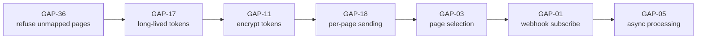
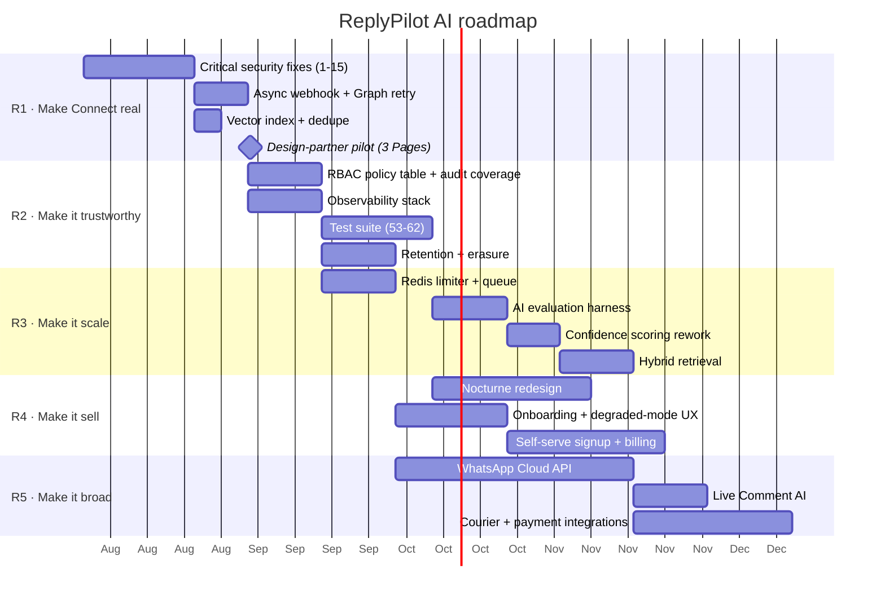

# 11 · Scorecard, gap register & roadmap

> 🏢 BIZ · 📦 PM · 🧑‍💻 ENG

Scores are assessed against **production multi-tenant SaaS**, not against a
demo. A prototype scoring 6/10 here is a good prototype.

---

## 11.1 Launch readiness scorecard

| Dimension | Score | Verdict |
| --- | --- | --- |
| **Architecture** | **7.5 / 10** | Clean layering, correct abstractions, no queue |
| **Product / UX** | **6.5 / 10** | Complete IA and 14 surfaces; degraded states invisible |
| **Security** | **5.5 / 10** | Excellent auth hardening; plaintext tokens and partial RBAC |
| **Scalability** | **4.5 / 10** | Stateless app, but in-memory limiter and synchronous webhook |
| **AI quality** | **7.0 / 10** | Genuinely well-designed ladder and guardrails; fake confidence, no evals |
| **Data model** | **8.0 / 10** | Thorough, well-indexed, correct tenancy — missing a vector index |
| **API design** | **7.5 / 10** | Consistent, well-documented errors with remediation hints |
| **Observability** | **3.0 / 10** | Health check and audit log only; no metrics, traces, or error tracking |
| **Testing** | **2.0 / 10** | One security test file; zero pipeline coverage |
| **Documentation** | **8.5 / 10** | Strong before this handbook; comprehensive after |
| **Meta integration** | **4.0 / 10** | Webhook path is excellent; Connect is a scaffold |
| **Operability** | **5.0 / 10** | Fail-fast startup and good logs; no runbooks until now, no alerting |
| | | |
| **LAUNCH READINESS** | **5.8 / 10** | **Ship to design partners. Not ready for open self-serve.** |

### Readiness by launch mode

| Launch mode | Ready? | Blockers |
| --- | --- | --- |
| Internal demo | ✅ **Yes** | none |
| Single pilot customer, operator-managed Page | ✅ **Yes** | set the production env checklist (§9.10) |
| 3–10 design partners, each with their own Page | ❌ **No** | GAP-17, GAP-18, GAP-01, GAP-11 |
| Open self-serve signup | ❌ **No** | all of the above + GAP-05, GAP-06, GAP-35, GAP-36 |
| Enterprise / regulated | ❌ **No** | + GAP-15, GAP-41, SOC2-grade audit and observability |

### What is genuinely excellent

These are not table stakes — they are above the standard for a v0.1 product and
should be protected in review:

1. The **decision ladder** in `bot/pipeline.ts` is ordered correctly, including
   the subtle handoff re-check after generation (rung 15).
2. **Raw-body HMAC verification** with `timingSafeEqual` — most implementations
   get this wrong.
3. The **deliberate removal of the unsigned-session fallback**, documented in a
   comment explaining the exact privilege escalation it closed.
4. `resolvePublicTenantId` — a real vulnerability, correctly fixed, with the
   reasoning preserved in the source.
5. **Graceful degradation** everywhere: no API key, budget exhausted, provider
   down, no page token — the customer always gets an answer.
6. `sanitizePromptField` — treating tenant config as untrusted input.
7. The **echo-event id flip** for handoff detection.
8. Error responses that **name the env var and the screen to fix it**.
9. **Fail-fast startup** validation in `instrumentation.ts`.
10. `vectorLiteral`'s finite check before raw SQL interpolation.

---

## 11.2 Gap register

| ID | Gap | Area | Severity | Effort | Chapter |
| --- | --- | --- | --- | --- | --- |
| GAP-01 | Webhook never subscribed via `subscribed_apps` | Connect | 🔴 Critical | M | 05 |
| GAP-02 | Permissions never verified; `permissionsOk` stays false | Connect | 🟠 High | S | 05 |
| GAP-03 | Only `pages[0]` is stored — no page selection | Connect | 🔴 Critical | M | 05 |
| GAP-04 | `mid` dedupe is read-then-write, racy | Pipeline | 🟠 High | S | 03 |
| GAP-05 | Webhook processed synchronously — Meta timeout risk | Runtime | 🔴 Critical | M | 02 |
| GAP-06 | In-memory rate limiter and AI budget | Runtime | 🟠 High | M | 04 |
| GAP-07 | No blob storage for KB source documents | Data | 🟡 Medium | M | 10 |
| GAP-08 | Comment AI has no live Graph calls | Comments | 🟡 Medium | M | 01 |
| GAP-09 | No session revocation | Auth | 🟠 High | S | 09 |
| GAP-10 | Global email lookup ignores tenant | Auth | 🟠 High | S | 03 |
| GAP-11 | Page tokens stored in plaintext | Security | 🔴 Critical | M | 09 |
| GAP-12 | WhatsApp not implemented | Channels | 🟡 Medium | XL | 07 |
| GAP-13 | `Order.qty` is a String | Data | 🟢 Low | S | 03 |
| GAP-14 | No vector index on `KbChunk.embedding` | Performance | 🟠 High | S | 03 |
| GAP-15 | No retention enforcement | Privacy | 🟡 Medium | M | 03 |
| GAP-16 | Sheet webhooks are fire-and-forget | Integrations | 🟡 Medium | S | 04 |
| GAP-17 | No long-lived token exchange | Connect | 🔴 Critical | S | 05 |
| GAP-18 | Sends use the global env token, not the page token | Connect | 🔴 Critical | M | 05 |
| GAP-19 | No token expiry / revocation detection | Connect | 🟠 High | M | 05 |
| GAP-20 | Reconnect creates duplicate `PageConnection` rows | Connect | 🟠 High | S | 05 |
| GAP-21 | 24-hour window / message tags not handled | Messaging | 🟠 High | M | 05 |
| GAP-22 | Handover Protocol not implemented | Messaging | 🟢 Low | M | 05 |
| GAP-23 | OAuth `state` is not single-use | Security | 🟡 Medium | S | 05 |
| GAP-24 | No typing indicator | UX | 🟢 Low | S | 05 |
| GAP-25 | No customer-turn prompt-injection defence | AI security | 🟠 High | S | 06 |
| GAP-26 | RAG chunks are not sanitised or delimited | AI security | 🟠 High | S | 06 |
| GAP-27 | Confidence is a constant, not a measurement | AI quality | 🟠 High | M | 06 |
| GAP-28 | SSRF guard is vulnerable to DNS rebinding | Security | 🟡 Medium | M | 06 |
| GAP-29 | No AI evaluation harness | Quality | 🟠 High | M | 06 |
| GAP-30 | No MFA | Auth | 🟡 Medium | M | 09 |
| GAP-31 | No password policy | Auth | 🟡 Medium | S | 09 |
| GAP-32 | No account lockout | Auth | 🟡 Medium | S | 09 |
| GAP-33 | Logins are not audited | Auth | 🟡 Medium | S | 09 |
| GAP-34 | `ADMIN_PASSWORD` back door | Auth | 🟠 High | S | 09 |
| GAP-35 | RBAC on 4 of ~14 mutating routes | Authz | 🟠 High | M | 09 |
| GAP-36 | Default-tenant fallback leaks prompts and catalogs | Tenancy | 🔴 Critical | S | 09 |
| GAP-37 | E-commerce API keys stored in plaintext | Security | 🟠 High | S | 09 |
| GAP-38 | No `Origin` check on mutations | Security | 🟢 Low | S | 09 |
| GAP-39 | File-upload validation unverified | Security | 🟡 Medium | S | 09 |
| GAP-40 | No webhook timestamp freshness check | Security | 🟡 Medium | S | 09 |
| GAP-41 | No customer data-erasure endpoint | Privacy | 🟠 High | M | 09 |
| GAP-42 | Graph sends are never retried | Reliability | 🟠 High | S | 10 |

**Severity distribution:** 7 critical · 17 high · 14 medium · 4 low.

### The seven critical gaps, in fix order

GAP-36 goes first because it is a two-line change that converts a silent
data-leak into a loud failure — which makes every subsequent fix testable.

---

## 11.3 Top 100 improvements

Ranked within each group by value ÷ effort. Effort: **S** ≤ 1 day, **M** ≤ 1
week, **L** ≤ 1 month, **XL** > 1 month.

### A · Critical correctness & security (1–15)

| # | Improvement | Gap | Effort |
| --- | --- | --- | --- |
| 1 | Refuse to answer unmapped Pages instead of falling back to the default tenant | GAP-36 | S |
| 2 | Exchange for a long-lived user token before reading `/me/accounts` | GAP-17 | S |
| 3 | Encrypt `PageConnection.accessToken` with AES-256-GCM | GAP-11 | M |
| 4 | Pass the per-page token into every Graph send | GAP-18 | M |
| 5 | Store all Pages and add a selection UI | GAP-03 | M |
| 6 | Call `POST /{page-id}/subscribed_apps` on connect | GAP-01 | M |
| 7 | Verify `/me/permissions` and set `permissionsOk` | GAP-02 | S |
| 8 | Add `@@unique([tenantId, pageId])` and upsert on reconnect | GAP-20 | S |
| 9 | Unique partial index on `(tenantId, mid)` + upsert-based dedupe | GAP-04 | S |
| 10 | Apply RBAC to every mutating dashboard route via a policy table | GAP-35 | M |
| 11 | Encrypt `EcommerceConnection.apiKey` | GAP-37 | S |
| 12 | Add `sessionVersion` for session revocation | GAP-09 | S |
| 13 | Scope the login email lookup to a tenant | GAP-10 | S |
| 14 | Remove or gate the `ADMIN_PASSWORD` back door in production | GAP-34 | S |
| 15 | Single-use, expiring OAuth `state` nonce | GAP-23 | S |

### B · Reliability & runtime (16–28)

| # | Improvement | Gap | Effort |
| --- | --- | --- | --- |
| 16 | Process webhooks with `after()` so Meta gets a fast 200 | GAP-05 | S |
| 17 | Introduce a durable queue for `reply.generate` | GAP-05 | M |
| 18 | Retry Graph sends with exponential backoff and jitter | GAP-42 | S |
| 19 | Move the rate limiter and AI budget to Redis | GAP-06 | M |
| 20 | Detect token expiry via a daily `debug_token` job | GAP-19 | M |
| 21 | Handle the 24-hour window with message tags | GAP-21 | M |
| 22 | Register a Meta deauthorize callback | GAP-19 | S |
| 23 | Add a scheduler for token health, follow-ups, and retention | — | M |
| 24 | Retry + dead-letter the Sheet webhooks | GAP-16 | S |
| 25 | Add a webhook timestamp freshness check | GAP-40 | S |
| 26 | Provider fallback chain in `generateAiReply` | — | M |
| 27 | Circuit breaker around the LLM provider | — | M |
| 28 | Graceful shutdown that drains in-flight pipeline work | — | S |

### C · AI quality (29–42)

| # | Improvement | Gap | Effort |
| --- | --- | --- | --- |
| 29 | Replace constant confidence with retrieval-similarity–based scoring | GAP-27 | M |
| 30 | Build a golden-set evaluation harness | GAP-29 | M |
| 31 | Wrap RAG chunks in explicit data delimiters and sanitise them | GAP-26 | S |
| 32 | Detect prompt injection in customer turns and route to escalation | GAP-25 | S |
| 33 | Add the HNSW vector index | GAP-14 | S |
| 34 | Hybrid retrieval with reciprocal-rank fusion (vector + `tsvector`) | — | M |
| 35 | Store Banglish transliterations alongside chunks | — | M |
| 36 | Rerank the top-20 chunks before prompting | — | M |
| 37 | Post-hoc validation: reject replies citing prices not in the catalog | — | M |
| 38 | Token-budget the knowledge blob instead of char-slicing | — | S |
| 39 | Per-tenant few-shot examples in the system message | — | M |
| 40 | Conversation memory summary for long threads | — | M |
| 41 | Stream LLM responses to the web widget | — | M |
| 42 | A/B framework for prompt variants with conversion as the metric | — | L |

### D · Observability (43–52)

| # | Improvement | Effort |
| --- | --- | --- |
| 43 | Structured JSON logging with a request id on every line | S |
| 44 | Error tracking (Sentry) with release tagging | S |
| 45 | Metrics: messages/min, reply source mix, p50/p95 latency, error rate | M |
| 46 | OpenTelemetry tracing across webhook → pipeline → LLM → Graph | M |
| 47 | Per-tenant usage dashboard: messages, LLM calls, budget burn | M |
| 48 | Alert rules from §10.5 wired to a pager | S |
| 49 | Audit `AuditLog` coverage — add login, config, catalog, connect events | S |
| 50 | Synthetic canary: a scripted conversation every 5 minutes | M |
| 51 | Real user monitoring for Core Web Vitals | S |
| 52 | Cost dashboard: LLM spend per tenant per day | M |

### E · Testing (53–62)

| # | Improvement | Effort |
| --- | --- | --- |
| 53 | Unit tests for every pipeline rung, asserting `reason` | M |
| 54 | Tenant-isolation test suite (§9.4) | M |
| 55 | Webhook signature test vectors, valid and tampered | S |
| 56 | Guardrail regression tests for all five escalation classes | S |
| 57 | RAG retrieval tests with a fixed corpus and expected chunks | M |
| 58 | Contract tests against a mocked Graph API | M |
| 59 | Load test: 100 concurrent webhooks, assert p95 and zero double-sends | M |
| 60 | E2E dashboard flows with Playwright | M |
| 61 | Accessibility CI (axe) on every dashboard route | S |
| 62 | Visual regression on the design-system components | M |

### F · Product & UX (63–78)

| # | Improvement | Effort |
| --- | --- | --- |
| 63 | Degraded-mode banners for budget, missing key, and missing token | S |
| 64 | Connect wizard with real progress and specific failure states | M |
| 65 | Onboarding checklist with time-to-first-reply as the north star | M |
| 66 | Prompt Builder live preview with latency and source badge | M |
| 67 | Inbox filters: needs-human, mine, unread, by priority | S |
| 68 | Bulk order actions (mark shipped, print invoices) | M |
| 69 | Catalog CSV import/export | M |
| 70 | Abandoned-lead follow-up automation using `abandonedLeadHours` | M |
| 71 | Saved replies / canned responses for agents | S |
| 72 | Mobile-first responsive pass on all 14 dashboard sections | M |
| 73 | Nocturne dark theme migration (chapter 08) | L |
| 74 | Command palette (⌘K) for navigation and actions | M |
| 75 | Real-time inbox updates (SSE or polling) | M |
| 76 | Notification system: email/push on escalation | M |
| 77 | Full Bangla localisation of the dashboard UI | L |
| 78 | In-product changelog wired to the Roadmap section | S |

### G · Data & privacy (79–86)

| # | Improvement | Gap | Effort |
| --- | --- | --- | --- |
| 79 | Retention purge job with per-tenant configuration | GAP-15 | M |
| 80 | Customer data-erasure endpoint | GAP-41 | M |
| 81 | Tenant data export (JSON + CSV) | — | M |
| 82 | Blob storage for KB source documents | GAP-07 | M |
| 83 | Normalise `Order.qty` to an integer with a parsed-text audit column | GAP-13 | S |
| 84 | Partition `Message` by month once it exceeds ~10M rows | — | M |
| 85 | Consent capture before collecting phone numbers in chat | — | S |
| 86 | PII redaction in logs via a shared `redact()` helper | — | S |

### H · Channels & integrations (87–94)

| # | Improvement | Gap | Effort |
| --- | --- | --- | --- |
| 87 | WhatsApp Cloud API (chapter 07) | GAP-12 | XL |
| 88 | Live Comment AI: delete spam and reply via Graph | GAP-08 | M |
| 89 | Instagram Direct via the same webhook | — | L |
| 90 | Telegram adapter | — | M |
| 91 | Real Shopify / WooCommerce catalog sync | — | L |
| 92 | Courier API integration (Pathao, Steadfast, RedX) | — | L |
| 93 | bKash / Nagad payment links in chat | — | L |
| 94 | Public embed API with per-tenant widget keys | — | M |

### I · Platform & business (95–100)

| # | Improvement | Effort |
| --- | --- | --- |
| 95 | Self-serve signup with tenant provisioning | M |
| 96 | Billing and plan enforcement (per-tenant AI budget by tier) | L |
| 97 | Usage-based metering and invoicing | L |
| 98 | White-label / reseller mode for agencies | L |
| 99 | Agent marketplace — swap the Sales Agent for Support / Booking agents | XL |
| 100 | Multi-region deployment with per-tenant data residency | XL |

---

## 11.4 Roadmap

### Release themes

| Release | Theme | Exit criterion |
| --- | --- | --- |
| **R1 — Connect is real** | A second tenant can connect their own Page and receive correct replies from it | Two tenants, two Pages, zero cross-tenant leakage in a 72-hour soak |
| **R2 — Trustworthy** | An incident can be detected, diagnosed, and audited | p95 detection under 5 min; tenant-isolation suite green in CI |
| **R3 — Scales** | 100 tenants, 100k messages/day | Load test passes with p95 < 5 s and zero double-sends |
| **R4 — Sells itself** | A shop owner onboards without a human | Median time-to-first-AI-reply under 15 min, self-serve |
| **R5 — Omnichannel** | WhatsApp reaches parity with Messenger | Same ladder, same guardrails, template lifecycle live |

### Success metrics per release

| Metric | Baseline | R1 | R3 | R5 |
| --- | --- | --- | --- | --- |
| Connected Pages | 1 (env token) | 3 | 100 | 500 |
| Messages/day | < 500 | 2,000 | 100,000 | 500,000 |
| p95 reply latency | ~4 s | < 3 s | < 2 s | < 2 s |
| Replies from `llm` | — | > 80% | > 90% | > 90% |
| Escalation precision | unmeasured | > 90% | > 95% | > 95% |
| Cross-tenant incidents | unknown | **0** | **0** | **0** |
| Test coverage | ~2% | 40% | 70% | 75% |
| Time to first AI reply | ~45 min | 20 min | 15 min | 10 min |

---

## 11.5 The 30-day plan

If only one month of engineering is available, do exactly this:

| Week | Focus | Deliverables |
| --- | --- | --- |
| **1** | Stop the leaks | #1 GAP-36 · #2 GAP-17 · #3 GAP-11 · #13 GAP-10 · #14 GAP-34 |
| **2** | Make Connect work | #4 GAP-18 · #5 GAP-03 · #6 GAP-01 · #7 GAP-02 · #8 GAP-20 |
| **3** | Stop losing messages | #16 `after()` · #18 Graph retry · #9 atomic dedupe · #33 vector index |
| **4** | See what is happening | #43 structured logs · #44 Sentry · #48 alerts · #54 isolation tests · #63 degraded banners |

At the end of 30 days the product moves from **5.8 → ~7.2** launch readiness and
becomes safe for a small cohort of design partners with their own Pages.

---

## 11.6 Handbook maintenance

| Trigger | Update |
| --- | --- |
| New API route | `04-api-reference.md` §4.1 index + a detail block |
| New env var | `02-architecture.md` §2.8 + `.env.example` |
| New pipeline rung | `06-ai-runtime.md` §6.1 ladder + the `reason` table in §4.4 |
| Schema change | `03-data-model.md` ER + table catalogue + index inventory |
| Gap closed | Move it to a "Resolved" list in §11.2 with the commit SHA |
| Score change | Update §11.1 with a one-line justification |
| New UI surface | `08-design-system.md` component tree + a wireframe |

Review cadence: §11.1 scores monthly, the gap register every sprint, everything
else on change.

---

**Back to:** [`README.md`](./README.md)
